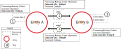
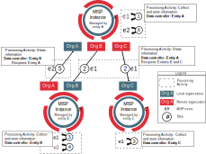
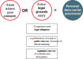

# Information sharing and cooperation enabled by GDPR

## Introduction

The General Data Protection Regulation (GDPR) aims to reduce legal uncertainty and limit the interpretations by setting out clear rules and conditions for the processing and sharing of personal data as well as the protection of natural persons with regard to the processing of personal data. Organisations must ensure that, they process only the minimum amount of personal data necessary to achieve their lawful processing purposes. To this end, the GDPR distinguishes the roles and obligations of data processors and data controllers, provides precise definitions of personal data and establishes the conditions under which information can be shared.

National and governmental Computer Security Incident Response Team (n/g CSIRTs) are teams that serve the government of a country by helping with Critical Information Infrastructure Protection (CIIP). They coordinate incident management with the relevant stakeholders at national level, and cooperate with the national and governmental teams in other countries.

The [Malware Information Sharing and Threat Intelligence Sharing Platform (MISP)](https://www.misp-project.org/) is a software for sharing, storing and correlating indicators of compromise of targeted attacks, cybersecurity threats and financial fraud indicators, among which SHA1 hashes (a cryptographic function to fingerprint files), threat actor names and Bitcoin addresses. The MISP data model is composed of "events", which usually represent threats or incidents, which in turn are composed of a list of "attributes" (e.g. IP addresses, domain names etc..). Other data models exist in MISP such as "objects", which allow advanced combinations of attributes and "galaxies" which enable a deeper analysis and categorisation of events.

Information sharing communities are enabled using tools like MISP. As a Computer Security Incident Response Team for the private sector communes and non-governmental entities in Luxembourg, [CIRCL](https://www.circl.lu/) created and operates several communities to automate information sharing at national, European and international levels.

## Who is the Controller and Processor when sharing information through MISP?

The GDPR clarifies the differences in the roles and responsibilities of data controllers and data processors. According to Art. 4(7), the **data controller** “determines the **purposes** and **means** of the processing of personal data”, either alone or in partnership with other data controllers (“joint controllers”).

The concept of data controller and data processor in a sharing environment is not always trivial, but can be summarized in the below diagram.

*FIGURE 1: PROCESSING ACTIVITIES AND DATA CONTROLLER IN THE GENERAL CASE OF INFORMATION SHARING*

* **Step 1** Entity A creates or collects a piece of information, “data 1”, as part of the processing activity “Collect and store information”. There is no data processor or recipient.
* **Step 2** Entity A shares “data 1” with entity B. In this case entity A is the data controller and entity B is a recipient, but not a data processor. Entity A holds the responsibility of selecting the entity to share with and ensuring a secure data transfer to entity B.
* **Step 3** Entity B stores the data locally and processes it for its own purposes. In this case entity B is responsible for the data stored and further processed. The data are no longer the responsibility of entity A.
* **Step 4** Entity B shares “data 2” to entity A. In this case entity B is the data controller of the separate processing activity “Share information”.

More generally, in a peer-to-peer network, all the peers are separate data controller for the processing activity “share information”. When the peers decide to process the shared information (e.g. store, update, and integrate it in other systems), they become the data controller of the separate processing. Any peer having access to a piece of information is responsible for determining the purposes of processing activities which can include whether to share it or not to share.

Below is a use case of information sharing using the tool MISP:

*FIGURE 2: PROCESSING ACTIVITIES AND DATA CONTROLLER IN THE SPECIFIC CASE OF SHARING INFORMATION WITH MISP PLATFORM*

* **Step 1** A MISP event “e1” is created by entity A. Entity A is the data controller, there is no data processor or recipient.
* **Step 2** The event is shared as “community only” to the remote organisation in the local instance of MISP at entity A (Org B and C). In this case entity A is the data controller of the activity “Share information”.
* **Step 3** Entities B and C store the event “e1” on their local MISP instance.
* **Step 4** Entity B creates a second event “e2”.
* **Step 5** Entity B share “e2” to entity A (“community only”). In this case, entity B is the data controller of the processing activity “Share information”.
* **Step 6** Entity A stores the event “e2”.

In a distributed MISP setup, every entity using a MISP instance connected to other MISP instances will be the data controller of the personal data they share (i.e. personal data going out of their system).

*Note: In any case software developers of the MISP platform are not responsible for any breaches on MISP instances hosted by other data controllers.*

## What information exchanged through MISP is personal data?

Personal data is defined as “any information relating to an identified or identifiable natural person (‘data subject’); an identifiable natural person is one who can be identified, directly or indirectly, in particular by reference to an identifier such as a name, an identification number, location data, an online identifier or to one or more factors specific to the physical, physiological, genetic, mental, economic, cultural or social identity of that natural person” (Art. 4(1), GDPR).

MISP serves a variety of actors from the public and private sector, therefore the categories of personal data exchanged may vary depending on the type of **actors involved** and the **purpose** of data processing (e.g. information sharing for the purpose of exposing financial fraud may include bank accounts or credit card numbers).

It is particularly important to note that **IP addresses can be considered as personal data** as they can allow data subjects to be identified (ECJ, Scarlet Extended case). Moreover, unless the controller is able to establish with certainty that the data do not correspond to data subjects that can be identified, the controller will have to treat all IP information as personal data (WP29, Opinion 1/2008). Dynamic IP addresses in some cases are also personal data, sometimes even when only the ISPs are in possession of additional data and able to identify the data subject, only if the data controller or processor has legal means — without disproportionate effort — of obtaining access to the information help by the ISP (ECJ, Patrick Breyer case). The mentioned landmark case provides for the criteria to be used to determine whether dynamic IP addresses qualify as personal data.

In the specific case of MISP used by CSIRTs, the first purpose of the share information processing activity is not to share personal data but rather IOCs mostly related to threat actors or threat actor groups. However, in most cases these IOCs contain personal data. Therefore, when exchanging personal data, **CSIRTs should be aware of their mandate, the mandate of the involved parties, as well as the data processing purposes to the fullest possible extent**.

One of the safeguards mentioned in the GDPR is pseudonymisation, defined as "the processing of personal data in such a manner that the personal data can no longer be attributed to a specific data subject without the use of additional information [..]". In MISP, event attributes are not linked to each other and usually do not enable the identification a data subject by themselves, without additional information. For example, having only an IP address, is usually not enough to identifiy a data subject without additional information from the ISP. As such, most of the event attributes can be considered as pseudonymised.
This statement should however be balanced, as specific attributes can sometimes by themselves enable an easier identification than others, such as the attribute "passport-number" or even a domain name in case the whois public database contains enough information. Furthermore, the "object" data model in MISP enables linking attributes to each other. Specifically the "person", "victim" and even the "whois" objects to name a few, can break the MISP pseudonymisation characteristic for specific sets of data. Those attributes and objects should be used and shared more carefully, in line with the legitimate purpose of the processing activity.

The figure below illustrates the MISP categories of data that could be exchanged through MISP which may include personal data in some cases.

  

*FIGURE 3: EXAMPLE OF MISP ATTRIBUTE CATEGORIES POTENTIALLY INVOLVING PERSONAL DATA (NON-EXHAUSTIVE)*

Currently, most of the MISP functionalities (i.e. attribute categories and types) for sharing data does not provide sharing data of special categories as defined in the GDPR (Art. 9), i.e. data revealing racial or ethnic origin, political opinions, religious or philosophical beliefs, or trade union membership, and the processing of genetic data, biometric data for the purpose of uniquely identifying a natural person, data concerning health or data concerning a natural person's sex life or sexual orientation. As an exception, Passenger Name Record (PNR), which may be considered in certain cases as special category of personal data, are supported by MISP.

However, specifically in the case of CSIRTs sharing IOCs through MISP, the processing activities involving sharing information are unlikely to involve special categories of personal data in order to fulfil their mandated purposes. It is not unlikely though, that future release of MISP and needs of CSIRTs would involve sharing such special categories.

## Does the GDPR allow CSIRTs to share information through MISP?

It is a common misconception that the GDPR decreases the possibility to share information between CSIRTs. The GDPR actually enables information exchange of personal data between CSIRTs as long as it is consistent with its purposes. **Recital 49 of the GDPR confirms that CSIRTs are encouraged to share information** provided that the processing **1)** is performed “to extent **necessary and proportionate for purposes of ensuring network and information security**” such as ensuring that the confidentiality, integrity and availability of the personal data stored or transmitted and the security of the related systems is preserved and **2) constitutes a legitimate interest of the data controller**, such as preventing unauthorised access to electronic communication networks and malicious code distribution or “denial of service” attacks. Additionally, recital 32 states that controllers and processors shall “implement appropriate technical and organisational measures to ensure a level of security appropriate to the risk”. Information sharing has to be perceived as essential security measure to lower the risk.

One can doubt that all entities and companies that work with cybersecurity are allowed to process personal data without having any distinction between CSIRTs and private providers of security services and technologies. Basically, everybody directly or indirectly involved in detecting or helping to detect IT incidents and cyber-attacks could potentially process large sets of personal data legitimately. 

First, we need to assess the legal value of recitals in a Regulation. They are not directly enforceable like the proper articles of a Regulation, but they help with the interpretation of the articles of the Regulation. The recital, together with the articles of the Regulation, means that CSIRTS and other subjects involved with cybersecurity can process personal data, provided that all rules are respected, such as the principles of necessity and proportionality.

Second, the recital indeed points out that the processing of personal data is allowed “to the extent strictly necessary and proportionate for the purposes of ensuring network and information security”. The data controller can process personal data only when it is really necessary to do it and according to the purposes of its activities towards its constituency. Therefore, while CSIRTs have a legitimate ground to process personal data that are necessary to fulfill their tasks, other private actors such as cybersecurity software vendors will have much less freedom to process personal data. The ultimate purpose of recital 49 is not to grant a general possibility to process personal data to all actors involved with cybersecurity but to assure that network and information security is achieved at the highest possible extent. 

The tasks to verify the correct application of recital 49 by CSIRTs is given primarily to the courts when they will assess the value of the evidence collected and exchanged by the CSIRTs. The Data Protection Authorities (DPAs) may be also confronted with this issue, e.g. in the framework of investigations. However, recital 49 is a guideline and a legal interpretation tool rather than a prescriptive provision.

A processing activity should comply with the six principles in Art. 5, which could be summarized as: "lawfulness, fairness and transparency", "purpose limitation", "data minimisation", "accuracy", "storage limitation" and "integrity and confidentiality". The first step is to make sure the processing activity is lawful.

For the processing activities for which CSIRTs act as data controllers, the lawful grounds for processing might be based on the Art. 6 (e) - processing is necessary for the performance of a task carried out in the public interest or in the exercise of official authority vested in the controller. Entities in an information sharing community may have different lawful grounds as described in Art. 6. However, whenever sharing is lawful, it should not be discouraged by these differences, and entities should state clearly their lawful grounds to enhance sharing.

In most cases, data input in MISP directly relate to an attack, and are already specifically selected from the large amount of data analysed during an incident, for being useful to detect and/or mitigate the attack. In those cases, MISP usage satisfies the **data minimisation principle and the purpose limitation principle**. MISP also includes features to assess the usefulness of IOCs for threat detection and/or mitigation. For example, the field "IDS" in the "attribute" data model allows attributes to be exported directly to the intrusion detection system of one's network. It is easily understandable that attributes marked as "IDS" are necessary to detect and/or mitigate the threat. Other fields can be mentioned such as "Sightings", allowing other organisations to react on the relevance of the specific attribute, and "Related Events" showing which event(s) also include the same attribute (if an attribute is included in several events, it is most likely not a false positive, and therefore relevant to mitigate the related threat).

The **retention period** might be very different depending on the use-case of a sharing community. The GDPR states that personal data must be "kept in a form which permits identification of data subjects for no longer than is necessary for the purposes for which the personal data are processed". In the case of MISP, as seen in the precedent chapter, personal data are in some cases already pseudonymised. Moreover, "personal data may be stored for longer periods insofar as the personal data will be processed solely for archiving purposes in the public interest, scientific or historical research purposes or statistical purposes". MISP use cases also include research on threat actors and attacks and may need to keep data for long retention periods, longer after the last occurrence of specific attacks, in order for example to discover attack patterns and produce statistics.
In the case where an entity no longer needs specific attributes in MISP, the entity has the possibility to delete the attributes (and events) on its local MISP instance. The creator of specific events or attributes can modify them, and other entities can amend events and attributes with information and corrections or propose the deletion of specific attributes, by creating a "Proposal Notification". These features could also be used in the scope of the **accuracy principle**. MISP includes a functionality to make a first "soft-delete" on a attribute level to keep a trace of the delete. An additional functionality, at MISP instance level, can be enabled to sanitise the contents of an attribute when a soft delete is done. The combination of these functionalities can support different levels of retention policy required by specific sharing communities.

## What are the grounds for processing information for the purpose of information sharing?

Under the GDPR, CSIRTs have the legal grounds for processing and sharing of information if “the data subject has given **consent** to processing for one or more specific purposes” (Art. 6(1)) or if **other legal grounds** apply. For example, CSIRTs can process personal data if it is necessary for the **performance of a contractual agreement** with the data subject. However, obtaining consent of the data subject is in many cases not feasible in practice and often impossible or illogical to obtain, but the policies of some CSIRTs provide that it is required when the data subject is the victim or target of a threat. In those cases where the consent is the legal ground for data processing, the specific conditions as prescribed by the GDPR should be followed: the consent should be freely given, specific, informed and unambiguous indication of the data subject's agreement to the processing of his or her personal data, The consent must be given by a statement or a clear affirmative action. Nonetheless, the data controller should be able to demonstrate it (Art. (7) Conditions for consent).

Furthermore, CSIRTs can process personal data without having obtained prior consent if they have **the legal obligation** to do so, in accordance with the powers and responsibilities set out in their mandate and with their constituency. It is nevertheless important to note that information sharing is not compulsory and under some mandates, CSIRTs may only be able to collect and process personal data for internal purposes.

Alternatively, CSIRTs can process personal data if acting under a specific mandate or delegation from an official authority to **protect public interests** (e.g. public or national security) or **if in the framework of a criminal investigation**. However the GDPR does not apply to such matters.

In addition, Recital 49 explicitly refers to CSIRTs’ right to process personal data provided that they have a **legitimate interest** and that such interests are not overridden by the fundamental rights and freedoms of data subjects. Collecting and processing information related to incidents and threats constitutes a legitimate interest for CSIRTs as it is aligned with the purpose and scope of most CSIRTs mandates. Indeed, sharing information will enable CSIRTs to better prevent and mitigate attacks by, for example, identifying compromised machines or infected victims and blocking malicious IPs.

However, in the light of the purpose limitation principle, CSIRTs do not have a lawful basis for using data obtained during a criminal investigation for other purposes not related to the investigation or retaining data for longer than is necessary for the purposes for which the personal data are processed.

Information sharing is not only key in the cybersecurity sector, but also in other sectors such as the Financial and Telecom sectors, to increase fraud detection. For example, payment service providers have the legal grounds for processing and sharing of information under the Payment Services Directive (PSD 1) and the revised Directive (PSD 2). Specifically, in recitals (49) of the PSD 1 directive, "provision should be made for the efficient exchange of data between payment service providers who should be allowed to collect, process and exchange personal data relating to persons involved in payment fraud". In the revised Payment Services Directive, Article 94 also mentions that "Member States shall permit processing of personal data by payment systems and payment service providers when necessary to safeguard the prevention, investigation and detection of payment fraud".

  

*FIGURE 4: LEGAL GROUNDS WHICH CAN ENABLE A DATA CONTROLLER OR PROCESSOR TO PROCESS PERSONAL DATA*

## Conclusion

The GDPR provides a new data protection framework that will allow information sharing, based on clear rules and conditions. CSIRTs are encouraged to collect, process and exchange personal data as long as it is performed within their legitimate interest. Information sharing is a powerful mechanism for successful identification and handling of incidents, in the cybersecurity, financial and telecoms sectors among others and will have a key role in the future of fraud detection and incident handling.

## References

1. [Regulation (EU) 2016/679 of the European Parliament and of the Council of 27 April 2016 on the protection of natural persons with regard to the processing of personal data and on the free movement of such data, and repealing Directive 95/46/EC, O.J.E.U., L 119/1 of 4th of May 2016.](http://ec.europa.eu/justice/data-protection/reform/files/regulation_oj_en.pdf)
2. [Directive 2007/64/EC of the European Parliament and of the Council of 13 November 2007 on payment services in the internal market amending Directives 97/7/EC, 2002/65/EC, 2005/60/EC and 2006/48/EC and repealing Directive 97/5/EC](http://eur-lex.europa.eu/legal-content/EN/TXT/PDF/?uri=CELEX:32007L0064&from=en)
3. [Directive (EU) 2015/2366 of the European Parliament and of the Council of 25 November 2015 on payment services in the internal market, amending Directives 2002/65/EC, 2009/110/EC and 2013/36/EU and Regulation (EU) No 1093/2010, and repealing Directive 2007/64/EC](http://eur-lex.europa.eu/legal-content/EN/TXT/PDF/?uri=CELEX:32015L2366&from=EN)
4. [Judgement of the Court (Third Chamber) of 24 November 2011. “Scarlet Extented SA v SABAM »](http://curia.europa.eu/juris/liste.jsf?language=en&num=C-70/10)
5. [Article 29 Working Party, Opinion 1/2008 on data protection issues related to search engines.](http://ec.europa.eu/justice/data-protection/article-29/documentation/opinion-recommendation/files/2008/wp148_en.pdf)
6. [ECJ, Patrick Beyer case](https://curia.europa.eu/jcms/upload/docs/application/pdf/2016-10/cp160112en.pdf)
7. [Mandate for the "security made in Létzebuerg” (SMILE) gie.](https://www.circl.lu/assets/files/letter-circl-2015.pdf)
8. Cynthia Wagner, Alexandre Dulaunoy, Gérard Wagener, and Andras Iklody. [MISP: The design and implementation of a collaborative threat intelligence sharing platform](https://www.foo.be/papers/misp.pdf). In *Proceedings of the 2016 ACM on Workshop on Information Sharing and Collaborative Security,* page 49-56. ACM, 2016.
9. [Andrew Cormack. Incident Response: Protecting Individual Rights Under the General Data Protection Regulation, Dec. 2016](https://script-ed.org/article/incident-response-protecting-individual-rights-under-the-general-data-protection-regulation/)

## Acknowledgment

This document was partially funded by CEF (Connecting Europe Facility) funding under CEF-TC-2016-3 - Cyber Security ***Improving MISP as building blocks for next-generation information sharing***.

## Contact and Collaboration

If you have any question or suggestion about this topic, feel free to [contact us](https://www.circl.lu/contact/). This document is a collaborative effort where external [contributors can propose changes and improvement](https://github.com/MISP/misp-compliance/tree/master/GDPR) the document.
