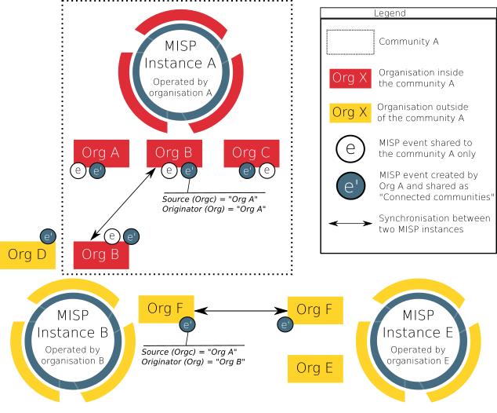

---
title: "MISP as supporting platform for sharing information, following ISO/IEC 27010:2015"
author: [CIRCL Computer Incident Response Center Luxembourg, MISP Project]
date: 2018-06-16
tags: [ISO/IEC 27010, misp, information sharing, information exchange, ISO 27010]
titlepage: true
toc-own-page: true
number-sections: true
titlepage-rule-color: EC2A3F
colorlinks: true
...

# MISP as supporting platform for sharing information, following ISO/IEC 27010:2015

Malicious cyber actors are becoming more organised, growing smarter and becoming more sophisticated, which is rendering traditional defence methods and tools significantly less effective in dealing with the constantly new threats appearing on the horizon.

One solution to this problem is the sharing of threat intelligence in order to raise awareness and sound the alarm about new attacks and data breaches as they happen. This helps to prevent major security incidents from recurring and emerging threats from claiming more victims.

In this context, the evolution of cyber threat intelligence sharing is culminating in the development of platforms and standards that help organisations gather, organise, share and identify sources of threat intelligence. Cyber threat intelligence is also shortening the useful life of attacks and is putting a heavier burden on attackers who want to stay in business. The [Malware Information Sharing and Threat Intelligence Sharing Platform (MISP)](https://www.misp-project.org/) is one of such platforms.

## Alignment with ISO/IEC 27010:2015, why it matters?

Threat intelligence sharing comes with its own caveats and presents a few challenges. For example, organisations may end up with raw, unevaluated data, which adds an extra burden to the security team of the organisations by increasing the number of events and alerts rather than decreasing them. Moreover, some security vendors loath to share information to avoid losing the competitive edge.

Some of these issues are dealt by the ISO/IEC 27000-series (also known as the 'ISMS Family of Standards' or 'ISO27k' for short) of standards. It comprises information security standards published jointly by the International Organisation for Standardisation (ISO) and the International Electro technical Commission (IEC). The ISO/IEC 27000 series of standards provides best practice recommendations on information security management.
The series is deliberately broad in scope, covering more than just privacy, confidentiality and cybersecurity issues. It is applicable to organisations of all shapes and sizes. All organisations are encouraged to assess their information risks, then treat them  according to their needs, using the guidance and suggestions where relevant (typically using information security controls).

One of such standards is ISO/IEC 27010:2015, covering ‘Information security management for inter-sector and inter-organisational communications’, a supplement to ISO/IEC 27001:2013 and ISO/IEC 27002:2013 for use by information sharing communities.

Standard ISO/IEC 27010 (hereafter, the standard) is particularly relevant for MISP because it provides controls and guidance specifically relating to initiating, implementing, maintaining, and improving information security in inter-organisational and inter-sector communications. Moreover, it provides guidelines and general principles on how the specified requirements can be met using established messaging and other technical methods.

The standard is applicable to all forms of exchange and sharing of sensitive information, both public and private, nationally and internationally, within the same industry or market sector or between sectors. In particular, it may be applicable to information exchanges and sharing relating to the provision, maintenance and protection of an organisation or nation state's critical infrastructures. It is designed to support the creation of trust when exchanging and sharing sensitive information, thereby encouraging the international growth of information sharing communities.

## Is MISP a tool suitable to be used in information sharing community?

MISP is a free and open source platform for sharing, storing and correlating cybersecurity threats and financial fraud indicators, among which SHA1 hashes (a cryptographic function to fingerprint files), threat actor names and Bitcoin addresses. The aim of this platform is to help improving the counter-measures used against targeted attacks and set-up preventive actions and detection. MISP allows organisations to share information about malware and their indicators (i.e. Indicators of Compromise or IOCs), providing its users with collaborative knowledge about existing malware or threats.

### Suitable data model

MISP is a tool specifically made to be used by information sharing communities, even when only some members of an organisation are permitted to access the information shared in MISP. As a tool, MISP includes data model objects such as "organisation" and "user" (of an organisation). The figure below highlights the mechanism to share event with MISP amongst organisation in the same community.

*FIGURE 1: Illustration of MISP organisations and community interactions*

The concept presented in the figure above can be explained and match with key concepts of the ISO/IEC 27010:2015 standard as described in the table below.

|ISO/IEC 27010:2015 key concepts|MISP data model representing the concepts|Related definition in  ISO/IEC 27000:2018|
|--- |--- |--- |
|Information sharing community|The concept of community is closely related to the concept of MISP server (also called MISP instance). A MISP server is a specific instance of the MISP software, running on a computer, usually a server. A MISP server can include multiple organisations. A MISP community includes all organisations on a MISP server and organisations running MISP servers that synchronise with this server.|3.34 information sharing community|
|Organization|A MISP organization represent an organisation in the community.|3.50 organization|
|Member of an organisation|MISP users represent organisation members.|Not covered in the standard.|
|Information exchange types (e.g. "alerts and warnings" and "incident handling")|MISP events are the smallest unit that can be shared in MISP. Events can be enrich with "tags", such as tags integrates external and broadly used protocols and standards such as TLD (Traffic Lights Protocol) and MISP galaxies which enable a deeper analysis and categorisation of events. Events are composed of MISP attributes, usually representing indicators of compromise (e.g. IP addresses, domain names etc.). Attributes are defined structure that have a limited set of  type and categories. Attributes can be aggregated into MISP objects.|3.21 event|
|Supporting entities|The centralized supporting entity in a MISP community can be interpreted as being the entity (or organisation) operating the MISP instance (also called MISP server). The entity operating the MISP instance decides who will join the community and can attribute rights to organisation on the MISP instance (e.g. right to synchronise a MISP server)|3.76 trusted information communication entity|
|Source|In MISP, the source of the event is indicated in the event detail in the field "Orgc". The source of an event stay the same even if the event is transferred to other communities.|Not covered in the standard.|
|Originator|In MISP, the originator of an event is indicated in the event detail in the field "Org". If the source is in the same MISP community than a recipient, the source (Orgc) and the originator (Org) of an event will be the same for this recipient. If the source of an event (Orgc) is not in the same community than a recipient (e.g. the event has been pushed to another MISP community because its sharing model is "All communities" or "Connected communities"), then the source (Orgc) and the originator will differ. In that case, the originator (Org) would appear as the organisation synchronising the MISP instances (for an illustration, refer to event e' in the "FIGURE 1" above).|Not covered in the standard.|
|Recipient|In MISP, the recipients of an event depends on the sharing model the originator choose for the event. MISP sharing model is flexible and include  five sharing models  allowing, for example, to only share an event with one organisation, one community or a couple of chosen organisations in a community.|Not covered in the standard.|

### Suitable flexibility and accessibility

MISP can be accessed from different interfaces like a REST API (for systems pushing and pulling IOCs and for automatizing export, import or analysis of IOCs) or via a web interface. This is the result of the inherent goal of MISP: to be a robust platform that ensures a smooth operation for sharing and storing cybersecurity related information in an intelligent way.

MISP is freely available on [GitHub](https://github.com/MISP/MISP), licensed under [GNU Affero General Public License version 3](http://www.gnu.org/licenses/agpl-3.0.html). Everyone can set up its own MISP instance and start a community. MISP is currently used by CSIRTs communities and Banks. However, MISP usages is not limited to those entities and new use cases can be developed.

## Does MISP enable an easy implementation of ISO/IEC 27010:2015 controls?

### Scope

ISO/IEC 27010:2015 complements ISO/IEC 27001:2005 by providing additional or augmented controls in cases where the information exchanged by sharing communities is sensitive and cannot be made publicly available. In this article, only new controls or augmented controls from ISO/IEC 27002:2005 by ISO/IEC 27010:2015 will be covered.

MISP is a tool, a piece of software, not an Information Security and Management System by itself. As such, not all the new controls or augmented controls in ISO/IEC 27010:2015 can be applicable to MISP. For this article, the controls that can, partially can or cannot apply to MISP are presented in the table below.

|New controls of controls augmented by ISO/IEC 27010:2015|Applicable to MISP|References to relevant MISP features|
|--- |--- |--- |
|5.1.1 Policies for information security|Partially|(5) Information security policies|
|5.1.2 Review of the policies for information security|No|N/A|
|7.1.1 Screening|No|N/A|
|8.1.3 Acceptable use of assets|Partially|(8) Asset management|
|8.2.1 Classification of information|Yes|(8) Asset management|
|8.4.1 Information dissemination|Yes|(8) Asset management|
|8.4.2 Information disclaimers|Yes|(8) Asset management|
|8.4.3 Information credibility|Yes|(8) Asset management|
|8.4.4 Information sensitivity reduction|Yes|(8) Asset management|
|8.4.5 Anonymous source protection|Yes|(8) Asset management|
|8.4.6 Anonymous recipient protection|Yes|(8) Asset management|
|8.4.7 Onwards release authority|Yes|(8) Asset management|
|10.1.1 Policy on the use of cryptographic controls|Yes|(10) Cryptography|
|12.2.1 Controls against malware|No|N/A|
|12.4.1 Event logging|Yes|(12) Operations security|
|12.7.2 Community audit rights|No|N/A|
|13.2.2 Agreements on information transfer|Partially|(13) Information transfer|
|13.2.3 Electronic messaging|Yes|Alternative methods to electronic messaging are part of the MISP synchronisation protocol (e.g. air-gap exchange protocol)|
|15.1.2 Addressing security within supplier agreements|No|N/A|
|16.1.2 Reporting information security events|Partially|(16) Information security incident management|
|16.1.6 Learning from information security incidents|Yes|(16) Information security incident management|
|16.1.8 Early warning system|Yes|(16) Information security incident management|
|17.1.1 Planning information security continuity|No|N/A|
|18.1.1 Identification of applicable legislation and contractual requirements|Partially|(18) Compliance|
|18.1.6 Liability to the information sharing community|No|N/A|

The below section highlights clarifications on which MISP features enables an easy implementation of ISO/IEC 27010:2015 controls applicable to MISP.

### (5) Information security policies

The standard recommends having policies for information security. This implies that sharing communities have a policy that defines how the community members will work together to set security management policies and direction for the information sharing communities.

As a tool that can be used in different ways by different entities, MISP does not actually have a specific “policy” as such. However, MISP does include a ‘Terms & Conditions’ feature that entities setting up a MISP instance can customized for their needs. For example, entities having a MISP instance be can customized in the text inside those Terms and Conditions (or can be left empty) and it can be opted to force users to accept it before having access to MISP. [Sharing guidelines](https://github.com/MISP/MISP/wiki/Sharing-guidelines) for using MISP are available.

### (8) Asset management

Regarding the implementation of acceptable use of assets, dissemination rules are a core concept and it is the originator, which decides of the dissemination rules for individual events (c.f. [MISP sharing model](ttps://github.com/MISP/misp-book/tree/master/using-the-system)). It is the role of the supporting entity, operating the MISP instance to not bypass these rules but to respect them. When specific tags are applied to an event, indicating how the information received can be used (e.g. [Permissible Actions Protocol taxonomy](https://www.misp-project.org/taxonomies.html#_pap)), these rules need to be respected by all organisations in the community.

The standard suggests that information should be classified in terms of legal requirements, value, credibility, priority, criticality and sensitivity to unauthorized disclosure or modification and that the dissemination of such information should be done accordingly to this classification. Moreover, each information exchange should indicate the originator’s degree of confidence in the transmitted information’s credibility and accuracy and the sensitivity of the information.

MISP has asset management tools build into it. For example, taxonomies can be used in MISP in order to classify events, indicators and threats. For example, one of the taxonomies included in MISP is the Admiralty Scale (also called the NATO System), that ranks the reliability of a source and the credibility of an information. Examples of taxonomies that can be used to classified events in MISP can be found below:

|ISO/IEC 27010:2015 classification requirements|Examples of taxonomies and/or features integrated in MISP (non-exhaustive)|
|--- |--- |
|Legal requirements (8.2.1)|No taxonomies are yet integrated. It is however possible to add custom taxonomy in MISP.|
|Value (8.2.1)|In some cases, the value of threat intelligence depends on the quality of the classification. A wide range of classifications is available for an event in MISP, for example, incident classification or topic taxonomies.
  Value of the information can also be determined by the  CSSA agreed sharing taxonomy, for example, the 'sharing-class' indicates whether the shared information has been validated by a human prior to sharing.|
|Credibility (8.2.1) and (8.4.3)|The Admiralty Scale taxonomy can be used to measure the credibility of an event.  The analyst experience taxonomy can be used to assess the credibility of an analysis of an event.  The likelihood-probability taxonomy can also be used to measure the credibility of an event.  The correlation feature and sightings can also help assessing the credibility of an event.  Whitelist and Warning lists improve false positive detection.|
|Priority (8.2.1)|MISP integrates six levels of priority aligned with NCCIC, DHS, and the CISS.|
|Criticality (8.2.1)|"Threat Level" of a MISP event indicates the level of criticality.  The impact overall rating taxonomy.  The victims employee count taxonomy.|
|Sensitivity (8.2.1)|NATO classification.|
|Dissemination markings (8.4.1)|Traffic Light Protocol (TLP) taxonomy.  Different level of sharing model can be used, restricting the propagation of events.|
|Information disclaimer (8.4.2)|There is no specific field or free text available at the event level in MISP to add a custom disclaimer to list any special requirements to follow by the recipients in addition to the normal information marking. However, it is possible to add custom taxonomies in MISP. Moreover, as explained in the two following points, it is possible to contact the reporter or ask for clarification.
	  In MISP it is possible to contact the reporter of an event to ask for clarification.  For each event, an 'Event Discussion Thread' can also be used to ask for clarification.|
|Sensitivity reduction (8.4.4)|Sightings in MISP can be used to evaluate the value of an attribute over time. Especially sightings of type "Expiration" can be added to an attribute to indicate that the attribute has lost value (e.g. URLs which have been cleaned after some time).  The MISP infrastructure-state taxonomy can also indicate if the adversary infrastructure at the event or attribute level is still active or is down.|

MISP also includes a feature to protect the anonymity of the source and the recipient of the information in the community (controls 8.4.5 and 8.4.6). With the MISP [delegation](https://www.circl.lu/doc/misp/delegation/) feature, an organisation can ask another organisation in the same community to publish its own event in order to remain anonymous. In a MISP instance, it is normally possible to consult the list of all organisations in the community. However, the operator of the MISP instance (in other words, the supporting entity) has the possibility to hide this list (enabled by the option “MISP.showorg”) ensuring anonymity of all recipients (i.e. organisations) in a community.

### (10) Cryptography

The standard puts forward ‘cryptography’ is a tool for sharing communities. Indeed, cryptographic techniques can be used to implement the dissemination rules of information sharing, e.g. through information rights management. MISP follows this recommendation because it has built-in the possibility to add SLL certificates for HTTPS and PGP Keys.

### (12) Operations security
When required by their communities, members should log the internal dissemination of shared information. In relation to the existence of an event logging system built-in into the platform, MISP has such a system.

### (13) Information transfer

MISP includes a ‘Terms & Conditions’ feature that entities setting up a MISP instance can customized for their needs. For more details refer to <a href="#(5)">(5) Information security policies</a>.

### (16) Information security incident management

In relation to ‘Information security incident management’, members of information sharing communities should consider whether detected events should be reported to other members of the communities. Likewise, investigations based on information distributed by the information sharing communities should be performed to reduce the risks of similar incidents and develop a better understanding of the risks facing the communities. Moreover, the standard recommends that an early warning system should be deployed within the communities to effectively communicate priority information as soon as it is available.

In this regard, MISP includes advanced data models created by its community. Indeed, MISP includes a simple and practical information-sharing format expressed in JSON through attributes that can be used by MISP or any other software. Moreover, the taxonomies allow for the classification of the incidents. However, at least part of this control cannot apply to MISP because it is out of the functionality of the platform. For example, the standard suggests that each member should ensure that reported incident responses are assessed. This cannot be managed through MISP because it needs to be implemented by its users.

### (18) Compliance

‘Compliance’ is a category to have in mind as well. Liability issues and remediation should be clarified, understood and approved by all members of the information sharing communities, to address situations in which information is unintentionally or intentionally disclosed. In this regard, the standard specifies that remediation should include, at a minimum, notification of any unauthorised disclosure back to the originator, and potentially also to the source, with sufficient detail to identify the information disclosed. Unauthorised disclosure consequences could directly affect the responsible parties and might involve eliminating or restricting access to certain members for some period of time to re-establish community trust.

As a sharing information platform based in Europe, and processing personal data from EU citizens, MISP needs to comply with the GDPR. However, compliance needs to be seen at the user level in MISP, as explained in a [recent article](https://github.com/MISP/misp-compliance/blob/master/GDPR/information_sharing_and_cooperation_gdpr.md), which analyse the relation between the GDPR and MISP. Nevertheless, it is worth to mention that MISP as a platform has built-in mechanisms that promote privacy by design and by default, helping the compliance with the GDPR of their users. For example, the users are guided by the platform in relation to the data that needs to be included when reporting vulnerabilities. Users can only fill event attributes according to a specific [data model](http://www.misp-project.org/datamodels/#misp-core-format). This means that MISP minimizes the data that is published on the platform to the minimum necessary (a strategy called "data minimization"). 

## Conclusion

MISP is a promising free and open source software platform that could help many stakeholders to be organised in order to improve their cyber-defence capabilities. Indeed, the MISP threat-sharing platform is a tool to help information sharing of threat intelligence including cybersecurity Indicators of Compromise (IOC), financial fraud or counter-terrorism information.
As demonstrated in this article, MISP is a flexible platform that thanks to an extensible tagging and well-structured sharing mechanisms can be used as a platform to support information sharing implementing the ISO/IEC 27010 standard. However, one must not forget that MISP is only a tool, and that it does not replace an information security management system (ISMS) by itself.

## References

1. [ISO/IEC 27010:2015 on "Information technology — Security techniques — Information security management for inter-sector and inter-organisational communications", 2015](https://www.iso.org/standard/68427.html)
2. [MISP User Manual](https://github.com/MISP/misp-book)
3. [MISP GitHub, "Information sharing and cooperation enabled by GDPR", 2018](https://github.com/MISP/misp-compliance/blob/master/GDPR/information_sharing_and_cooperation_gdpr.md)

## Acknowledgment

This document was partially funded by CEF (Connecting Europe Facility) funding under CEF-TC-2016-3 - Cyber Security ***Improving MISP as building blocks for next-generation information sharing***.

## Contact and Collaboration

If you have any question or suggestion about this topic, feel free to [contact us](https://www.circl.lu/contact/). This document is a collaborative effort where external [contributors can propose changes and improvement](https://github.com/MISP/misp-compliance/tree/master/GDPR) the document.
