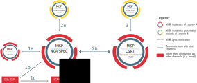

# How MISP enables stakeholders identified by the NISD to perform key activities

Network and Information Security (NIS) means ‘the ability of a network or an information system to resist accidental events or unlawful or malicious actions that compromise the availability, authenticity, integrity and confidentiality of data and the related services’ . The Directive on security of network and information systems (NISD) lays down specific obligations for Member States of the EU to adopt a national NIS strategy, to designate National Competent Authorities (NCA), Single Points of Contact (SPoC) and specific NIS tasks to Computer Security Incident Response Teams (CSIRTs). In addition, the NIS Directive establishes security and incident notification requirements for Operators of Essential Services (OES) such as banking, energy, financial market infrastructure, digital infrastructure; and Digital Service Providers (DSP), including online marketplaces, online search engines and cloud services. Furthermore, it creates a cooperation group in order to develop trust amongst MSs and facilitate strategic cybersecurity information sharing. In parallel, it creates a CSIRTs network to build confidence amongst MSs to boost operational cybersecurity cooperation.

The [Malware Information Sharing and Threat Intelligence Sharing Platform (MISP)](https://www.misp-project.org/) is an open source tool which primary purpose is to share cyber threat intelligence. It is broadly used in the CSIRTs community in the EU and beyond. It can be used for many other activities in addition to share cyber threat intelligence. Therefore, this article takes a closer look at how MISP can support stakeholders mentioned in the NISD to better perform the tasks identified therein. Especially CSIRTs, OESs and DSPs are the stakeholders that could benefit the most from using MISP in the scope of the NISD. Member States and Single Point of Contacts could also use MISP for the performance of their tasks, especially as a tool to receive and share NIS events and notify NIS incidents.

## How MISP can support CSIRTs participating in the CSIRTs network

As mentioned before, the CSIRTs Network aims to facilitate operational cooperation between Member States in managing NIS incidents. The CSIRTs network is responsible for multiple tasks, including supporting MSs in addressing cross-border incidents, exchanging best practices on the exchange of information related to incident notification, and assisting MSs in building capacity in NIS. We summarise below the tasks where MISP can be directly or indirectly of support for the individual CSIRTs participating in the CSIRTs Network. Note that the tools used by the individual CSIRTs is a choice made by each one of them. The table below demonstrates how CIRCL understands that MISP could support without implying that all CSIRTs use or will use MISP.

<table>
	<tr>
		<th>
			CSIRTs network task as described in Article 12 of the NISD
		</th>
		<th>
			Can MISP support?
		</th>
	</tr>
	<tr>
		<td>
			(a) exchanging information on CSIRTs' services, operations and cooperation capabilities;
		</td>
		<td>
			Not applicable
		</td>
	</tr>
	<tr>
		<td>
			(b) at the request of a representative of a CSIRT from a Member State potentially affected by an incident, exchanging and discussing non-commercially sensitive information related to that incident and associated risks; however, any Member State's CSIRT may refuse to contribute to that discussion if there is a risk of prejudice to the investigation of the incident
		</td>
		<td>
			<b>Yes</b>
		</td>
	</tr>
	<tr>
		<td>
			(c)	exchanging and making available on a voluntary basis non-confidential information concerning individual incidents;
		</td>
		<td>
			<b>Yes</b>
		</td>
	</tr>
	<tr>
		<td>
			(d)	at the request of a representative of a Member State's CSIRT, discussing and, where possible, identifying a coordinated response to an incident that has been identified within the jurisdiction of that same Member State;
		</td>
		<td>
			Not applicable
		</td>
	</tr>
	<tr>
		<td>
			(e)	providing Member States with support in addressing cross-border incidents on the basis of their voluntary mutual assistance;
		</td>
		<td>
			<b>Yes</b>
		</td>
	</tr>
	<tr>
		<td>
			(f)	discussing, exploring and identifying further forms of operational cooperation, including in relation to: (i) categories of risks and incidents; (ii) early warnings; (iii) mutual assistance; (iv) principles and modalities for coordination, when Member States respond to cross-border risks and incidents;
		</td>
		<td>
			<b>Yes</b>
		</td>
	</tr>
	<tr>
		<td>
			(g)	informing the Cooperation Group of its activities and of the further forms of operational cooperation discussed pursuant to point (f), and requesting guidance in that regard;
		</td>
		<td>
			Not applicable
		</td>
	</tr>
	<tr>
		<td>
			(h)	discussing lessons learnt from exercises relating to the security of network and information systems, including from those organised by ENISA;
		</td>
		<td>
			Not applicable
		</td>
	</tr>
	<tr>
		<td>
			(i)	at the request of an individual CSIRT, discussing the capabilities and preparedness of that CSIRT;
		</td>
		<td>
			Not applicable
		</td>
	</tr>
	<tr>
		<td>
			(j)	issuing guidelines in order to facilitate the convergence of operational practices with regard to the application of the provisions of this Article concerning operational cooperation.
		</td>
		<td>
			Not applicable
		</td>
	</tr>
</table>

### How MISP can support Article 12 (b) exchanging and discussing information related to incidents and associated risks

MISP initial purpose was to exchange information about ‘events’. Events can be of different types but one of the most common type of events is ‘incident’. With MISP, it is possible to build communities to exchange specific [data structures](https://www.circl.lu/doc/misp/categories-and-types/) about an incident such as operational description in term of ‘payload delivery’, ‘network activity’ and ‘attribution’. Therefore, MISP can be used by CSIRTs to exchange operational information about an incident in support of Article 12 (b). 

In addition, MISP taxonomies and galaxies allow to indicate the risk of an incident, e.g. using the MISP threat-level taxonomy (other taxonomies related to criticality and priority can be found [here](https://github.com/MISP/misp-compliance/blob/master/ISO_IEC_27010/misp-sharing-information-following-ISO-IEC-27010.md#8-asset-management)). Therefore, MISP can be used by CSIRTs participating in the CSIRTs network to exchange and discuss information related to risks associated to incidents.

There are different ways in MISP to initiate discussions.

* **Forums** can be used to discuss non-event related topics while discussions can be accessed on the top "Global Actions - List Discussions". This is the least relevant way to communicate for the purpose of Article 12 (b) as these discussions do not concern incidents. Note that forums and discussions are not synchronized between MISP instances.
* There a possibility to add **comments to events** in which case various CSIRTs can add further comments to an event (which can represent an incident). Note that the CSIRTs network meets physically and tools are not used to discuss during such meetings. However, topics put forward during CSIRTs network meetings can be prepared or further discussed by individual CSIRTs before or after CSIRTs network meetings. Therefore, the comments function in MISP is in support of Article 12 (b). Note however that comments are not synchronized between MISP instances.
* The last option is to **contact a reporter** (e.g. a CSIRT) which can be used to contact by e-mail the person in the organisation that created the event. All E-Mails can be enforced to be encrypted. This allows for contacting a reporter without having any contact details and in a more confidential one-to-one manner which can be useful to discuss commercially sensitive information related to an incident. Note however that if the reporter would chose to reply, his or her contact details will be revealed. Therefore, this function in MISP could also be in support of Article 12 (b)

### How MISP can support Article 12 (c) exchanging and making available on a voluntary basis non-confidential information concerning individual incidents

MISP supports five distribution settings: your organisation only (the most restrictive), community only, connected community, all communities, sharing group. In MISP the distribution settings can be set at the level of individual events representing individual incidents. Therefore, MISP can support exchanging individual incidents. This means that sharing can be done in a fully voluntary fashion even when not having any synchronisation functionality enabled.

MISP also allows to differentiate non-confidential from confidential information. Specifically, the confidentiality of events representing incidents in MISP can be indicated using various taxonomies such as the NATO classification. On top of that, it is possible to limit the synchronisation between other MISP instances by tags (i.e. taxonomies). It is for example possible to filter out (in other words not to share) all events with the tags ‘nato:classification="CTS"’ (NATO COSMIC TOP SECRET). Therefore, MISP is in support of Article 12 (c) for whichever CSIRTs participating in the CSIRTs network using MISP outside of the CSIRTs network meetings. Note that the MISP GUI allows for easily printing information using in any browser about individual events which could allow CSIRTs to bring handouts to CSIRTs network meetings. Moreover, the MISP-Darwin project will enable to automatically generate natural language reports out of MISP events.

### How MISP can support Article 12 (e) in addressing cross-border incidents on the basis of voluntary mutual assistance

According to the 2013 Cybersecurity Strategy ‘a particularly serious cyber incident or attack could constitute sufficient ground for a Member State to invoke the EU Solidarity Clause (Article 222 of the Treaty on the Functioning of the European Union (TFEU)).’ Therefore, for the purpose of this article, we consider mutual assistance in the context of cyber crises. However, mutual assistance is triggered by a CSIRT (either voluntary or obligatory depending on the context) and does not relate to the use of any tools.

Addressing cross-border incidents can be here interpreted as cross-border incident response. MISP can help in the incident response process to (non-exhaustive):

* Analysing observables and malware collected during an incident (e.g. domain name, IP addresses etc.). For example assessing whether observables are indicators of compromise or false positives (e.g. thanks to the ‘correlation graph’ and ‘expansion modules’). On top of that, MISP can also be combined with Security Incident Response Platforms such as [TheHive](https://blog.thehive-project.org/2017/06/19/thehive-cortex-and-misp-how-they-all-fit-together/) to (1) analyse observables during an incident, (2) import and (3) export events from MISP to TheHive and vice-versa.
* Sharing the real-time analysis of an incident with the MISP organisations (in this case CSIRTs participating in the CSIRTs network). MISP events representing an incidents are not static once created, and it is possible for the MISP organisation that has created the event to modify or add attributes to the event after the event creation. Additionally, it is also possible for another MISP organisation than the one which created the event to propose a modification to an attribute, or to propose some additional attributes to the creating organisation. This feature is called ‘proposal’. The creating MISP organisation of the event will be able to see any proposals and discard or accept the changes. This feature is **particularly interesting in incidents involving multiple parties, such as during cross-border incidents**. Therefore, this function in MISP could also be in support of Article 12 (e)

### How MISP can support Article 12 (f) exploring and identifying further forms of operational cooperation in relation to four areas.

#### (i) categories of risks and incidents
More than being a tool, MISP also became a [standard for threat intelligence and security related events and incidents](https://github.com/MISP/misp-rfc). Specifically, MISP taxonomies and galaxies enable risks and incidents categorisation (e.g. [Europol incident  taxonomy](https://www.misp-project.org/taxonomies.html#_europol_incident)). Being an open source software developed on GitHub, MISP allows and encourages CSIRTs to contribute on the features and development of the MISP software. CSIRTs can therefore contribute by proposing new taxonomies to categorize risks and incidents. Those new taxonomies will then be available to them, to further explore and identify the most relevant ones.

#### (ii) early warnings
First let’s take a look at the definition of early warning. ‘Early warning’ is indeed not explicitly defined in the NISD. From the ENISA Report on Cyber Crisis Cooperation and Management, an early warning is a system that **enables preventative measure due to detailed diagnosis** for decision-making in order to intervene, plan and implement a response to a crisis or incident. By sharing IoCs and by providing means to automate import and export of IoCs, MISP gives support to CSIRTs but also to any other entities that desire to detect and block threats in their network and information system. Indeed, [one of the main goals of MISP is to feed protective or detection tools](https://circl.lu/assets/files/misp-training/luxembourg2017/integration.pdf) with data such as Security Information and Event Management (SIEM), Intrusion Detection System (IDS) and Intrusion Prevention System (IPS).

Another definition is available from the [European commission, defining early warning](http://ec.europa.eu/information_society/newsroom/cf/dae/document.cfm?doc_id=4438) as If an organisation comes across a cyber threat (regardless of whether this threat has succeeded in its objectives of attacking the organisation), **valuable information might be gained on the attacker’s tools, techniques, protocols** (amongst other indicators). Sharing this information with other parties can **aid them in protecting themselves from potential attacks in the future**. It is this type of information that the study refers to as “early warnings”.

As a threat intelligence platform, MISP enable data sharing as well as data analysis. As an example, MISP provide a correlation graph to link events and attributes with each other and modules to quickly analyse and gain more information on an attribute. In MISP and specifically with the galaxies functionality, events can be linked to Advanced Persistent Threat (APT) groups, and APT groups can be then analysed more globally, taking into account a large set of events. All this functionality enables valuable information to be gained on the attacker’s tools, techniques, protocols. As this information will then be shared to other parties, MISP can therefore be seen as part of an early warning based on the definition of the European commission.

#### (iii) mutual assistance
MISP allows [collaboration](https://www.circl.lu/doc/misp/sharing/#collaboration) between users of organisations in the same MISP instance. Specifically, mutual assistance is enhanced in MISP through forums, discussion threads and the possibility to contact the reporter of an event.

#### (iv) principles and modalities for coordination
MISP includes a ‘Terms & Conditions’ feature that organisations operating a MISP instance can customize for their needs. For example, MISP organisations be can customize the text inside those Terms and Conditions and it can be opted to force users to accept it before having access to MISP. Moreover, an example of sharing guidelines for MISP is available. In each community, such sharing guidelines can be created and distributed to the organisation members.

While performing activities in the above mentioned four areas, CSIRTs can use MISP to explore and identify further forms of operational cooperation in relation to mutual assistance.

## How MISP can further enable CSIRTs performing their tasks

MISP enables CSIRTs to perform all tasks mentioned in the NIS Directive. The next table summarises these tasks and the sections below further explain how MISP supports these tasks.

<table>
	<tr>
		<th>
			CSIRTs network task from Annex I (2)
		</th>
		<th>
			Supported by MISP?
		<th>
	</tr>
	<tr>
		<td>
			(a) (i)	monitoring incidents at a national level;
		</td>
		<td>
			<b>Yes</b>
		<td>
	</tr>
	<tr>
		<td>
			(a) (ii)	providing early warning, alerts, announcements and dissemination of information to relevant stakeholders about risks and incidents;
		</td>
		<td>
			<b>Yes</b>
		<td>
	</tr>
	<tr>
		<td>
			(a) (iii)	responding to incidents;
		</td>
		<td>
			<b>Yes</b>
		<td>
	</tr>
	<tr>
		<td>
			(a) (iv)	providing dynamic risk and incident analysis and situational awareness;
		</td>
		<td>
			<b>Yes</b>
		<td>
	</tr>
	<tr>
		<td>
			(a) (v)	participating in the CSIRTs network.
		</td>
		<td>
			<b>Yes</b>
		<td>
	</tr>
	<tr>
		<td>
			(b) CSIRTs shall establish cooperation relationships with the private sector.
		</td>
		<td>
			<b>Yes</b>
		<td>
	</tr>
	<tr>
		<td>
			(c) promote the adoption and use of common or standardised practices for incident and risk-handling procedures; incident, risk and information classification schemes.
		</td>
		<td>
			<b>Yes</b>
		<td>
	</tr>
</table>

### (a) (i)	monitoring incidents at a national level

For the purpose of this article, monitoring means observing and checking the progress or quality of something over a period of time; keep under systematic review. In case of incidents, CSIRTs can monitor incidents happening at **national level** in term of **resolution steps** and **impact over time** and take appropriate measures if needed.

In MISP it is possible to indicate what EU Member States are affected for each event representing an incident thanks to the [veris country](https://www.misp-project.org/taxonomies.html#_country) taxonomy. Therefore, CSIRTs can filter incidents relevant to their own Member State. In addition, various taxonomies are available in MISP to indicate the steps in the incident resolution such as the [status of events used in Request Tracker](https://www.misp-project.org/taxonomies.html#_rt_event_status) and the analysis levels. In terms of impact, the NISD states that to determine the impact of an incident, the following parameter shall be taken into account:

<ol type="a">
  <li>the number of users affected by the disruption of the essential service;</li>
  <li>the duration of the incident;</li>
  <li>the geographical spread with regard to the area affected by the incident.</li>
</ol>

MISP provides taxonomies which could partially support describing NISD impact criteria e.g. for (a) the number of users affected the veris victim employee count taxonomy can be used, for (b) the duration of the incident, veris timeline taxonomy could be considered and for (c) the geographical spread, the taxonomy veris country can be used.

As previously highlighted, MISP events representing incidents can be modified even after their creation. Regular modification of the event will therefore enable monitoring over time.

Therefore, MISP can support the monitoring of incidents at national level by CSIRTs.  

### (a) (ii) providing early warning, alerts and dissemination of information to relevant stakeholders about risks and incidents

As previously highlighted, MISP can be used as part of an early warning. MISP is a tool to share information but it also has an alert feature that enables a user to receive emails when events are created in the system or major changes occurs in the events.

The MISP data structure includes information about risks and incidents. MISP can also be used by CSIRTs for dissemination of such information to relevant stakeholders, for example to the private sector, OESs, DSPs or other CSIRTs on the condition that those stakeholders have (1) an organisation in the CSIRTs MISP instances and (2) a minimum of understanding on how to use MISP.

### (a) (iii) responding to incidents

As previously highlighted, MISP can be use in the scope of incident response.

### (a) (iv) providing dynamic risk and incident analysis and situational awareness

As implied in the ENISA CSIRT baseline capability report, dynamic risk analysis can be understood, for CSIRTs, as being a similar concept as the concept of situational awareness. As previously highlighted, MISP can be used to support incident analysis and provide taxonomies about risk which can be modified over time, and can therefore be seen as dynamic.

The NISD does not provide a definition of ‘situational awareness’. However, in its Report on Cyber Crisis Cooperation and Management Comparative study, ENISA defines situational awareness as ‘the knowledge and understanding of the current operational status, risk posture, and threats to the cyber environment gained through instrumentation, reporting, assessments, research, investigation, and analysis, which are used to enable well-informed decisions and timely actions to pre-empt, deter, defend, defeat, or otherwise mitigate against those threats and vulnerabilities’.

A MISP server or instance can have a significant database of events representing incidents. Thanks to a classification mechanism enabled by taxonomies and galaxies, statistics can be made from a MISP instance to deduce from all the incidents the current operational status, risk posture, and threats to the cyber environment. Such analytics could for example be computed via a custom script, by using the MISP API, supporting many programing languages such as python with [PyMISP](https://github.com/MISP/PyMISP).

### (a) (v) participating in the CSIRTs network

As explained in the above chapter, MISP can be used by individual CSIRTs participating in the CSIRTs Network. In addition, information about events and incidents residing in MISP can be discussed during meetings of the CSIRTs network.

### (b) CSIRTs shall establish cooperation relationships with the private sector

Giving access to the private sector on their MISP instance, is one way for CSIRTs to establish cooperation relationships with them.

### (c) promote the adoption and use of common or standardised practices for:

#### (i) incident and risk-handling procedures

Not applicable as MISP does not include any documentation on procedures.

#### (ii) incident, risk and information classification schemes

As described in the above chapter, MISP is also a [standard for threat intelligence and security related events and incidents](https://github.com/MISP/misp-rfc). Specifically the MISP standard includes information classification schemes in the form of taxonomies to describe incidents and risks.

## How MISP can support OESs and DSPs

### How MISP can support OESs and DSPs with their security requirements

OESs and DSPs should take appropriate and proportionate technical and organisations measures to manage the risk posed to the security of networks and information systems. For mature organisations, in term of security, MISP can enhance security by providing an early warning system as described in above chapter.

### How MISP can support OESs and DSPs with their incident notification requirements

<table>
	<tr>
		<th>
			CSIRTs network task from Annex I (2)
		</th>
		<th>
			Supported by MISP?
		</th>
	</tr>
	<tr>
		<td>
			Notify any incident having a “significant” or “substantial” impact to the NCA or to the CSIRT without undue delay.
		</td>
		<td>
			<b>Yes</b>
		</td>
	<tr>
	<tr>
		<td>
			Notify impact of incident if OESs relies on a third-party DSP.
		</td>
		<td>
			<b>Yes</b>
		</td>
	<tr>
	<tr>
		<td>
			Inform the public about individual incidents if required by the notified competent authority or CSIRT.
		</td>
		<td>
			Not applicable
		</td>
	<tr>
</table>

### Notify any incident having a “significant” or “substantial” impact to the NCA or to the CSIRT without undue delay.

Additionally to security requirements, OESs and DSPs have specific incident notification requirements under the NISD. OESs and DSPs should notify the National Competent Authority (NCA) or the relevant CSIRT of any incident of "significant impact" (Art. 14 (3)) for the OESs and "substantial impact on the provision of a service as referred to in Annex III" (Art. 16 (3)) for the DSPs. The NCA and CSIRT can then share the incident to other Member States, other CSIRTs or to the public depending on the context.

The distribution mechanism of MISP could facilitate such notification activities. However, the initial use case in MISP was to share to all organisations within a community or wider. Nevertheless, with the ‘sharing group’ functionality in MISP, it is possible to better control to what extent information is shared and to which community members. This can be beneficial, especially regarding sensitive or confidential events. As highlighted, MISP provides taxonomies which could partially support NISD impact criteria. Additionally to OESs criteria to measure whether an incident has a significant impact, DSPs need to take into account the following criteria:

<ol type="a" start="4">
<li>the extent of the disruption of the functioning of the service;</li>
<li>the extent of the impact on economic and societal activities.</li>
</ol>

However, these criteria for the moment are not directly supported by MISP.

As a concrete example of how OESs and DSPs could use MISP as a notification mechanism in practice, please refer to the [Annex](#annex).

### Notify impact of incident if OESs relies on a third-party DSP.

OESs can notify that they rely on a DSPs thanks to the [eu-nis-sector-and-subsectors](https://www.misp-project.org/taxonomies.html#_eu_nis_sector_and_subsectors) taxonomy and the [eu-market-and-public-admin](https://www.misp-project.org/taxonomies.html#_eu_marketop_and_publicadmin) taxonomy.

## Conclusion

MISP can support CSIRTs participating in the CSIRTs network mainly with the tasks related to information sharing and cooperation in the context of incident handling. In addition, MISP can further enable CSIRTs performing their tasks set out in Annex I of the NISD. Finally, MISP can support OESs and DSPs with complying with their security requirements as well as with their incident notification requirements. Indeed, MISP is already broadly used by CSIRTs and some OESs and DSPs. Some of the CSIRTs in the EU already have their own MISP instance connected to their constituency. 

## Acknowledgment

This document was partially funded by CEF (Connecting Europe Facility) funding under CEF-TC-2016-3 - Cyber Security ***Improving MISP as building blocks for next-generation information sharing***.

## Contact and Collaboration

If you have any question or suggestion about this topic, feel free to [contact us](https://www.circl.lu/contact/). This document is a collaborative effort where external [contributors can propose changes and improvement](https://github.com/MISP/misp-compliance/tree/master/NISD) the document.

## Annex

As an example on how MISP can be used as an incident notification tool in the context of the NISD. In this example, OESs and DSPs of country A must notify first the National Competent Authority (NCA) of country A. In this example, the NCA also acts as a Single Point of Contact (SPoC).

 

<i>FIGURE 1: Examples of notification configuration</i>

In the above figure, the MISP synchronisation (represented by each and every arrow) can be either one way or two ways depending on how MISP instances are connected between each other. In any case, the synchronisation between MISP instances of OESs and DSPs should at least allow the OESs and DSPs to push events to the NCA/SPoC MISP instance. Moreover, as clarified in Art. 14 (5), CSIRTs should provide follow-up information on the incident notified by the OESs and DSPs. In this case, a two ways synchronisation is preferable. The following section details the main steps of incident notification depicted in the above figure.

### Step 1

The OES or DSP notifies the NCAs in case of an incident having a significant impact. OESs or DSPs have several possibilities to report the MISP event representing the NIS incident:

<ol type="a">
<li>Use their own MISP instance synchronised with the NCA MISP instance to create the MISP event representing the NIS incident (if the OES or DSP has one) and synchronise it with the MISP instance of the NCA.</li>
<li>Use the NCA MISP instance to create a MISP event representing the incident.</li>
<li>If the OES or DSP does not want to use MISP, it can send the MISP event representing the NIS incident details by another communication channel and the NCA can add the MISP event in its MISP instance itself.</li>
</ol>

The OES or DSP has several possibilities in terms of [‘distribution settings’](https://github.com/MISP/misp-book/tree/master/using-the-system#creating-an-event) in MISP:
* **Sharing group**: the OES or DSP can use a sharing group only including the NCA for example. This is the most likely approach. The MISP event representing the NIS incident will only be shared to the organisation members of the sharing group.
* **This Community-only**: the MISP event representing the NIS incident will be shared to all other OESs, DSPs, NCA from other countries, National CSIRT and any other organisations in the NCA MISP instance.
* **Connected communities**: the MISP event representing the NIS incident will be shared to the connected communities, for example CSIRTs from other countries
* **All communities**: the MISP event representing the NIS incident will be shared recursively without limit.
If the incident is sensitive, OESs or DSPs would most likely use a restrictive sharing group by default (only including the NCA for example).

### Step 2

The NCA in step 2 will decide to whom it wants to share the MISP event representing the NIS incident, including:

<ol type="a">
<li>Other Member State, e.g. SPoC of other member states. NCA or CSIRTs shall inform the other affected Member State(s) if the incident has a significant impact on the continuity of essential services in that Member State (Art. 14 (5)).</li>
<li>The national CSIRT(s).</li>
</ol>

If the event was previously created by the OES or DSP within a restricted sharing group, the NCA would need to edit the event representing the incident in MISP to change its distribution setting. This action is only available to an "admin" user in MISP, therefore the NCA should use an admin role to handle the incident distribution. The NCA will be able to choose a sharing group more appropriate than the currently existing one, also including any other Member States which could be significantly impacted by the incident. The OES or DSP would be able to see the resulting sharing group ensuring transparency on the entities the NCA transfer the event to.

If the incident was communicated to the NCA by the OES or DSP by other means than MISP, the NCA can choose the appropriate sharing group when creating the event in MISP based on the information received by those means.

### Step 3

The National CSIRT can also decide to share the event to other CSIRTs. In this case, the National or sectoral CSIRT can either: 

* Modify the event sharing group to add other EU CSIRTs (only possible if they have an ["extend" role](https://www.circl.lu/doc/misp/using-the-system/#create-and-manage-sharing-groups)) 
* Change the Distribution setting of the event to another sharing group.
