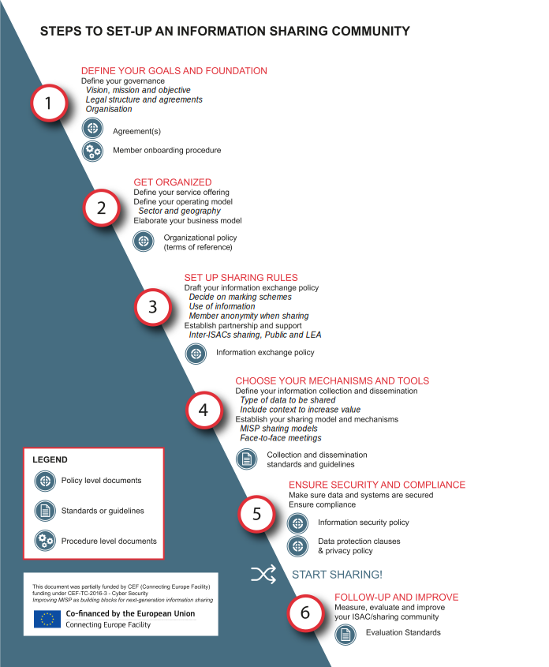

---
title: "Guidelines to setting up an information sharing community such as an ISAC or ISAO"
author: [CIRCL Computer Incident Response Center Luxembourg, MISP Project and X-ISAC.org]
date: 2019-03-11
tags: [misp, information sharing, information exchange, ISAC, threat intelligence, ISAO]
titlepage: true
toc-own-page: true
number-sections: true
colorlinks: true
titlepage-color: "77a5ef"
titlepage-text-color: "FFFFFF"
titlepage-rule-color: "FFFFFF"
titlepage-rule-height: 1
...

# Guidelines to setting up an information sharing community such as an ISAC or ISAO

The objective of this guideline (this document) is to **describe the practical aspects of setting up a new information sharing community**, such as an Information Sharing and Analysis Centre (ISAC) or an Information Sharing and Analysis Organisation (ISAO). In this guideline, we will refer to individuals or organisations that intend to set up a sharing community as "you" or the "operator".

Relevant research has already been conducted and published by organisations such as the European Union Agency for Network and Information Security (ENISA) and the ISAO Standards Organisation. Our guideline provides **practical best practices** to set up an information sharing community based on feedback and experience from existing information sharing communities.

This guideline is focused around the [Open Source Threat Intelligence Sharing platform (MISP)](https://www.misp-project.org/) used in support on information sharing activities.

## Introduction: ISACs, ISAOs and PPPs

Malicious cyber actors are becoming more organised, smarter and more sophisticated, which is rendering traditional defence methods and tools less effective in dealing with new threats appearing. One solution to this problem is the sharing of information about cyber threats and incidents. This helps to prevent major security incidents from recurring and emerging threats from claim.

This chapter aims at defining the types of sharing organisations and clarifying their differences. Specifically, the paragraphs below will focus on the differences between ISACs, ISAOs and Private Public Partnership (PPPs). Additionally, X-ISAC (pronounced Cross-ISAC) will also be introduced.

### Resources and legal context around ISACs and ISAOs

The most relevant publications on ISACs and PPPs in the EU are the [ENISA Cooperative Models for Effective Public Private Partnerships Good Practice Guide](https://www.enisa.europa.eu/publications/good-practice-guide-on-cooperatve-models-for-effective-ppps) and the [ENISA study on Information Sharing and Analysis Center (ISACs) - Cooperative models](https://www.enisa.europa.eu/publications/information-sharing-and-analysis-center-isacs-cooperative-models).

In addition, the US based ISAO Standards Organisation published a number of resources on how to set-up ISAOs. The ISAO Standards Organisation has been established by the 2015 [Executive Order 13691](https://obamawhitehouse.archives.gov/the-press-office/2015/02/13/executive-order-promoting-private-sector-cybersecurity-information-shari), and is defined as a “non-governmental organisation [..] to improve the US’s cybersecurity posture by identifying standards and guidelines for robust and effective information sharing and analysis related to cybersecurity risks, incidents, and best practices”.

Similar to the EU NIS Directive, the US has a legal framework fostering information sharing. Information sharing and ISAO have been promoted by Executive Order 13691, the [Presidential Policy Directive 21](https://obamawhitehouse.archives.gov/the-press-office/2013/02/12/presidential-policy-directive-critical-infrastructure-security-and-resil) and the [Cybersecurity Information Sharing Act](https://www.congress.gov/bill/113th-congress/senate-bill/2588/text) and the Cybersecurity Information Sharing Act. The latter, signed into law on December 2015, promoting information sharing in the context of cybersecurity threats, especially between the private sector and the government.

### What is the difference between an ISAC, PPP and ISAO?

According to [ENISA](https://www.enisa.europa.eu/publications/public-private-partnerships-ppp-cooperative-models/at_download/fullReport), a **public private partnership** (PPP) is a “long – term agreement/cooperation/collaboration between two or more public and private sectors and has developed through history in many areas”. ISACs are more formal than PPPs and they can be a form of PPPs, according to an [ENISA study](https://www.enisa.europa.eu/publications/information-sharing-and-analysis-center-isacs-cooperative-models/at_download/fullReport).

While PPPs and ISACs are concepts defined by ENISA, the concept of ISAO seems to be formulated in the US as a “group created to gather, analyse, and disseminate cyber threat information”, which is a concept similar to the ENISA definition of ISACs. According to the [Homeland security FAQ](https://www.dhs.gov/isao-faq) the main difference between ISACs and ISAOs is that “ISAOs are not directly tied to critical infrastructure sectors”. Instead, ISAOs offer a more flexible approach to self-organised information sharing activities amongst communities of interest such as small businesses across sectors.

What can be understood is that unlike the US definition, the EU definition of ISACs is not specifically tied to critical infrastructure sectors (similar to Operators of Essential Services in the EU), therefore aligning itself to the US definitions of both ISACs and ISAOs. The differences between ISACs, ISAOs and PPPs can be summarised in the table below:

|Features|ISAC|ISAO (US)|PPP|
|--- |--- |--- |--- |
|Geographical scope of applicability|Concept used internationally|Concept mainly used in the US|Concept used internationally|
|Formalisation & flexibility|More formal than PPPs|More flexible than US definition of ISAC|Less formal than ISAC|
|Ties to critical infrastructure sectors|EU: Broad scope, all critical infrastructure sectors and more, US: Tied to critical infrastructure sectors|Broad scope, all critical infrastructure sectors and more|Broad scope, all critical infrastructure sectors and more|
|Sector|EU: Cross sectors or sector-specific, cross countries or country-focus, US: Sector-specific and country-focused|Cross sectors or sector-specific, cross-country or country-focus|Cross sectors or sector-specific, cross countries or country-focus|

### Cooperation between information sharing communities, ISACs and X-ISAC

Cooperation not only takes place within an ISAC, but can also take place between ISACs. For example, the Finnish National Cyber Security Center (NCSC-FI) facilitates communication between multiple ISACs. The NCSC in the Netherlands and the Centre for Cybersecurity in Belgium have a similar setup.

In the context of cooperation between ISACs, the X-ISAC platform was created. The aim of X-ISAC is not only to assist communities in creating their own ISAC but also in encouraging ISACs to interconnect. X-ISAC is operated and maintained by the Computer Incident Response Center Luxembourg (CIRCL) and the MISP Project. It uses the MISP standard formats and technologies to enable information sharing communities to benefit from different sharing models. More information can be found on the [X-ISAC website](https://www.x-isac.org).

## Steps and guidelines to set up an information sharing community such as an ISAC

Information sharing communities facilitate digital interaction supported by tools as well as physical interaction, for example by attending meetings. In other words, an information sharing community is a community of entities or people interacting physically and virtually. The human factor is particularly important to build trust amongst the members of the community, as highlighted by ENISA, as described in their article [Tools and Methodologies to Support Cooperation between CSIRTs and Law Enforcement](https://www.enisa.europa.eu/publications/tools-and-methodologies-to-support-cooperation-between-csirts-and-law-enforcement).

For that to happen in an organised and scalable way, a minimum level of elaboration, formalisation and definition of rules can be implemented, the choice of which may vary depending on the information sharing community size and type.

The following chapters will suggest an approach to tackle the challenge of creating an information sharing community. Specifically, description of the steps to set-up information sharing communities will be provided along with resulting documents. The analysis laid down in the following chapter is based on questions and challenges that have been faced and experienced by organisations that have created information sharing communities.

### Level of the documentation

In many organisations, documents may be distinguished on three levels: policy level, standard level and procedural level as described below. Note that the documents mentioned throughout this guideline are non-exhaustive, but instead aim to provide a subset which could be considered as the most important ones for setting up an information sharing community.

* **Policies**: Formally documented management expectations and intentions. Policies are used to drive decisions and to ensure a consistent and appropriate development and implementation of processes, standards, roles, activities, IT infrastructure etc. A policy is usually technology or solution independent.
* **Standards/Guidelines**: Standards refer to mandatory activities, actions, or rules. Standards can give a policy support and reinforcement in terms of direction. They provide the means to ensure that specific technologies, applications, parameters, and procedures are implemented in a uniform (standardised) manner across the organisation. Guidelines are recommended actions and operational guides for when a specific standard does not apply.
* **Procedures**: Procedures are detailed step-by-step tasks that should be performed to achieve a certain goal. Procedures spell out how the policy, standards, and guidelines will actually be implemented in an operating environment.

### High-level steps to set up an information sharing community

The following infographic describes six suggested steps to set up an information sharing community, including eight recommended documents to be drafted. Each step will be further described and expanded on in the following chapters.

## 1. Define your goals and foundation

### 1.1. Define your governance

#### 1.1.1. Define your vision, mission and purpose

Defining the vision, mission and purpose is key to keep the efforts of the information sharing community in the right direction and to communicate with third parties and potential new members. Answering the questions such as: “What do you want to accomplish with the creation of the information sharing community?” and “Are the information sharing community objectives clear?” can be of help for this step.

For example, REN-ISAC has defined [its mission](https://www.ren-isac.net/what-we-do/Mission.html).

#### 1.1.2. Create a legal structure if necessary

#### 1.1.3.  Choose the type(s) of agreements on information sharing

Information sharing is intrinsically about communication between parties, and communication usually involves some kind of agreement(s) to enable the involved parties to understand each other. In existing information sharing communities and specifically ISACs, different options may be considered to formalise those information sharing agreements. A non-exhaustive list of those options are discussed below.

“**Subscriber agreement**”, [as featured for example by A-ISAC](https://www.icao.int/cybersecurity/SiteAssets/A-ISAC/12_05_14_A-ISAC_Sub_Agmt_12_5_14_Final.pdf) is a **legally binding** type of agreement. It is more suitable for regulating the relationship between private entities (companies). It is also a solid option in case there are any **commercial activities** foreseen as part of the information sharing community. Subscriber agreements allow for the establishment of various types of memberships specifying the types of accessible information, the method of receiving it, the number of user IDs or the level of participation in the work groups. This type of agreement often describes **sanctions** in case of failure to comply with the requirements (e.g. termination of the agreement without a possibility to regain membership in the following X years). 

“**Confidentiality/NDA agreement**” can be a separate document or can be integrated in a “subscriber agreement”, “operational rules” or “policy” as a “confidentiality/NDA clause”. It can be included in a contractual framework imposed on the parties (service providers or the organisations requesting their services). Such an agreement or clause establishes **what (type of) information can be considered as confidential**. In doing so, it might refer to confidential (“TLP Amber” or up) classification under the Traffic Light Protocol (TLP). It can also set obligations for the recipient of the confidential information, such as:  

* to not disclose any confidential information to any third parties, 
* not to use it except as needed in order to provide specific services or as required by law, 
* limit the dissemination to those with the need to know, as well as 
* notify immediately in case of misuse of this information, etc. 

It is possible to include the definition of the “personal data” and “processing of personal data” in line with the data protection regulations such as the GDPR. Additionally, this type of agreement may provide the conditions under which the parties may be asked to disclose confidential information to law enforcement agencies, governmental authorities or other third parties.

“**Code of Conduct**” represents a non-legally binding document which provides straightforward instructions on the standard practices and provides guidance on the behaviour of the members of the organisation. It can include the values and the scope of the information sharing community, liability in case of misconduct and standard of practices, as well as actions (exclusively disciplinary). Additionally, a Code of Conduct is close to a gentlemen's agreement (see below), but has a written form and may be signed by all members (respectively candidates). An example can be found on the [E-ISAC web page](https://www.eisac.com/Documents/E-ISAC_Code_of_Conduct.pdf) or for a shorter version on the [CERT.LU web page](https://www.cert.lu/#about).

“**Memorandum of understanding**” (MoU). Unlike the “Code of Conduct”, the MoU is a bilateral agreement, which means it is usually signed by the information sharing community and an entity willing to establish a mutual framework for cooperation. This type of agreement is common for formalising information sharing initiatives with governmental agencies, law enforcement agencies, public entities or other information sharing communities/ISACs. It is usually provided under the MoU that information cannot be forwarded to other parties. Since the agreement is not legally enforceable, it does not create binding obligations to its parties. Yet, a violation of it may result in a warning or termination of membership (see an example [here](https://www.europol.europa.eu/publications-documents/public-redacted-ec3-memorandum-of-understanding-between-europol-and-f-secure-edoc-837500-v2)).

“**Gentlemen’s agreement**” is an informal agreement that is based on trust of the members of the organisation. It does not require any formalisation and is usually communicated orally. It is important to highlight the difference of the gentlemen’s agreement and a common verbal agreement (contract) that has a legally binding effect. Indeed, a contract can be established either verbally or in writing. However, in civil law countries (Luxembourg, France, Germany, etc.) a contract requires the following essential elements: it has to “offer” the terms which must be sufficiently clear and “acceptance” indicating the intention to be bound by the agreement [18] meaning that the parties shall explicitly make an agreement enforceable in law.

The table below summarises the different types of agreements:

|Agreements on information sharing|Use|Type|
|--- |--- |--- |
|Subscriber agreement|Is a solid option in case there are any commercial activities foreseen as part of the information sharing community|Legally binding|
|NDA |Usually bi-lateral, often used with law enforcement or government bodies|
|Code of conduct|Usually multi-lateral, provides straightforward instructions on the standard practices and guide the behaviour of the members of the organisation|Usually not legally binding but in written form|
|MoU|Usually bi-lateral, often used with law enforcement or government bodies|Usually not legally binding but in written form|
|Gentlemen’s agreement|Based on trust of the members of the organisation. It does not require any formalisation and usually takes oral form|Usually in oral form|

However, based on experience with information sharing communities, not every information sharing community has formal agreements drafted. Many communities are built on trust and informal communication. Thus, the decision of whether to implement a formal information sharing agreement may also depend on the size and purpose of the information sharing community.

#### 1.1.4. Define what would be the consequences for non-compliance with the information sharing community rules

Consequences for non-compliance are commonly described in agreements on information sharing.

#### 1.1.5. Define what would happen if an entity decides to leave the sharing community (exit/termination clause) or changes its status

Exit clauses are commonly described in agreements on information sharing. For example, members leaving the information sharing community may be required to destroy all information received.

Beyond exit clauses, a sharing community may agree on the consequences of two or more members merging. For example, whether to create one entity or keep entities separated in an information sharing platform such as MISP. Member A merging with member B may not be given the access to information previously restricted to member B for example.

More generally, questions can be raised on what to do when a member changes its (legal) status. For example, entities based in the UK might leave the EU and may no longer have the right to share information within sharing communities located in the EU.

#### 1.1.6. Define the organisation of your sharing community

Information sharing communities' governance may vary from formally defined structures with a chairman, management board and secretariat to less defined ones with volunteers and work load distribution between information sharing community members. For example, every member of the information sharing community can participate in meeting organisation, e.g. by hosting the meeting themselves, ensuring that each time the host changes.

Information sharing communities seeking profit can also have different membership models depending on the level of service offered by the community. For example, FS-ISAC has [different types of membership](https://www.fsisac.com/sites/default/files/FS-ISAC_OperatingRules_June2016.pdf), from “critical modification only” to “platinum member”, depending on the type of information shared.

Membership models can also depend on the status of the members. For example, Global System for Mobile Communications Association (commonly referred as "GSMA") has [different types of memberships](https://www.gsma.com/membership/membership-types/) ("full", "associate" and "rapporteur") whether the member is a GSM licensed operator or involved in the mobile ecosystem.

#### 1.1.7. Choose the acceptance criteria of new members and plan future growth

Criteria for joining the information sharing community should be defined. Below are some examples of criteria and/or acceptance processes:

* All current members of the community need to vote for a new membership acceptance
* A current member of the community needs to guarantee that the future member can be trusted
* The future member should match a specific sector or localisation requirement (e.g. country)
* The future member should have had a direct face-to-face meeting or communication with a current member
* The future member should share common goals and/or objectives with the operator of the information sharing community

#### 1.1.8. Create a marketing and communication strategy

An information sharing community may define its communication strategy. For example, the information sharing community may want its number of members to remain limited in size. On the other hand, an information sharing community may want to grow and attract new members. The latter can be done for example by going to conferences and meetings about cybersecurity to invite organisations to join the community or having a website and publishing information.

## 2. Get organised

### 2.1. Define your service offering

Information sharing communities often have a couple of common capabilities such as information sharing, information analysis, trust building and capacity building. Information shared can be cyber threats, vulnerabilities, incidents, physical threats, mitigating measures, situational awareness, strategic analyses, best practices and tools.

#### 2.1.1. Decide what services you want the information sharing community to offer additionally to sharing

Examples of specific services or capabilities an information sharing community may offer in addition to the ones mentioned above are listed hereafter:

* Supporting forensic analysts
* Collaboration with law enforcement
* Vulnerability information sharing
* Security Operation Center (SOC) services
* Vulnerability management services
* Provide qualification services of the information shared
* Mutualisation of data collection and mining

### 2.2 Define your operating model

#### 2.2.1. Define the type of ISAC/information sharing community

Information sharing communities can be categorised according to two main axes: (1) whether the information sharing community is limited to one sector or it is crossing sectors, and (2) its geographical scope (e.g. country focused, EU, international scope).

####  2.2.2. Understand the benefit of cross-sectorial sharing

Cross-sectorial sharing may happen:

1.	Inside a cross-sectorial information sharing community/ISAC.
2.	Across information sharing communities e.g. in inter-ISACs collaboration. Cross-sectorial sharing may take place between two sector-specific ISACs of different sectors. Refer to chapter (3.2.1) for inter-ISACs cooperation.

A cross-sectorial information sharing community can bring the following benefits compared to a sector-specific sharing community:

* The reuse of TTPs and information across sectors, leading to **better threat detection and prevention** while being hit by a **threat another sector has previously faced**.
* An increase in **analysis capabilities** by broadening the correlation scope. It has been experienced that seemingly unrelated data may be interesting to correlate. Broadening the correlation scope is specifically interesting in analysing hybrid threats.
* By sharing with other sectors, members of a sharing community will be better prepared to share with a large audience, therefore increasing their **readiness** for **possible mandatory sharing obligations** and for **reaching out to CSIRTs** when needed.

Being a CSIRT, the more sectors you involve in your information sharing community, the more entities you can help increase their information sharing practices, and therefore, increasing the sharing maturity across sectors. Indeed, CSIRTs are generally speaking ahead when it comes to information sharing maturity.

### 2.3. Elaborate your business model

#### 2.3.1. Choose your funding model

Examples of funding models can be:

* **Membership**, where members pay a fee to the information sharing community operator.
* **Subscription**, where members pay to subscribe to a service provided by the information sharing community.
* **Public fund**. In this model, an information sharing community can receive funding from public bodies and/or public grants.
* **Donation**. In some cases, organisations support the sharing community/ISAC without being a member while giving a donation to ensure the continued operation of the sharing community.

The funding models of sharing communities/ISACs can be mixed and evolving over time.

#### 2.3.2. Choose your funding mechanisms

A sharing community may seek profit or be a non-profit organisation. An information sharing community seeking profit may for example offer paid services to the community members or provide them for free but monetise them afterwards by using information collected along with the feedback received from members of the sharing community to improve their business.

## 3. Set up sharing rules

### 3.1. Draft your information exchange policy

An information exchange policy can include, according to [FIRST Information Exchanged Policy framework](https://www.first.org/iep/FIRST_IEP_framework_1_0.pdf) four parts:

* **Handling** policy statements define any obligations or controls on information received to ensure the confidentiality of information that is shared.
* **Action** policy statements define the permitted actions or uses of the information received that can be carried out by a recipient.
* **Sharing** policy statements define any permitted redistribution of information that is received. For example enforcing dissemination marking such as TLP. Also the sharing policy can define in which case information sharing is mandatory or voluntary.
* **Licensing** policy statements define any applicable agreements, licenses, or terms of use that governs the information being shared.

The following chapters provide guidelines to create the information exchange policy.

#### 3.1.1. Define obligations or controls on information received (Handling)

Refer to chapter 5. “Ensure security and compliance”.

#### 3.1.2. Define for what purpose the information shared can be used (Action)

#### 3.1.3. Define the license of the information shared (Licensing)

#### 3.1.4. Choose your dissemination marking and disclosure (Sharing)

Members may share information following the Traffic Light Protocol (TLP) and/or the Chatham House Rules. A policy may also help clarify the definition of TLP for the community.

REN ISAC has defined a [sensitivity marking including restriction in dissemination](https://www.ren-isac.net/membership/MembershipDocs/REN-ISAC_Info_Sharing_Policy.pdf), which also includes disclosure standards and breach reactions. E-ISAC has drafted those markings as well in their [information sharing policy](https://www.eisac.com/cartella/Asset/00006344/TLP_WHITE_E_ISAC_Guidance_4_2017.pdf?parent=64210).

#### 3.1.4. Identify whether a part of information shared is mandatory (e.g. regulatory) and/or voluntary sharing

In the EU, mandatory information sharing requirements may come from the NIS Directive requirements as well as Telecom, GDPR, PSD2 and national or local regulatory requirements. An information sharing community can share uniformly mandatory and voluntary information as long as the information is properly contextualised.

#### 3.1.5. Decide whether anonymity of member sharing is acceptable

An example of an anonymity clause can be found in the REN ISAC [non-attribution policy](https://www.ren-isac.net/membership/MembershipDocs/REN-ISAC_Info_Sharing_Policy.pdf).

For example, a member of the information sharing community can ask the information sharing community operator to publish its information in their stead. This feature is called ["delegation" in MISP](https://www.circl.lu/doc/misp/delegation/).

Another possibility to ensure members' anonymity when sharing is to provide the member intending to share information anonymous access. Usually the user receiving the delegation belongs to the entity operating the sharing community such as a CSIRT.

#### 3.1.6. Decide whether you allow sub-communities and how you manage it

Based on the experience gained with information sharing communities, smaller subsets of members often form individual information sharing communities. For example within a national private-sector sharing community, specific communities related to financial institutions can form.

The operator of the information sharing community should decide whether the community allows a sub-set of members to share only amongst themselves. A subset of members may have separate contractual agreement(s) to share information only amongst the subset members. It is important for the community operator to use their best judgement to decide which communities should be separated from one another and whether compartmentalisation is the right approach for growing sub-communities.

The MISP software has different channels detailed below to enable sub-communities or subsets of members with the same interest to filter what information to share and receive:

* MISP allows the import and export of flat files, therefore enabling sub-communities to perform manual data transfers, outside of any network, in an air-gapped fashion.
* The MISP “[feeds](https://www.circl.lu/doc/misp/managing-feeds/)” can help compartmentalise information depending on specific interests of sub-communities.
* The [sharing groups feature](https://www.circl.lu/doc/misp/sharing/#sharing-groups) allows members of a sub-community to share exclusively between each other.

If you are a CSIRT running a national community, consider bootstrapping these sub-communities in order to assist them when they are starting out. Organisations can of course self-organise, but CSIRTs or the operator(s) of the sharing community are the ones with the expertise to get a sub-community started, for example by creating guidelines on what should be shared inside or outside of the given sub-community.

### 3.2. Establish partnership and support

####  3.2.1. Choose whether and how inter-ISACs collaboration should happen

Refer to chapter <a href="#2.2.2">(2.2.2)</a> to understand the benefits of cross-sectorial sharing.

#### 3.2.2. Decide to have partnership with LEA/public entities and how

See part <a href="#1.1.3">(1.1.3) Choose the type(s) of agreements on information sharing </a> on how you may manage agreements with public entities.

## 4. Choose your mechanisms and tools

### 4.1. Define your information collection and dissemination standard and best practices

#### 4.1.1. Identify the relevant sources of data for sharing inside your information sharing community

For example, information exchanged can come from:

* Open Source INTelligence (OSINT)
* Aggregation of automated collection (sandboxing, honeypots, spamtraps, sensors)
* Situational awareness tools to monitor trends and adversary TTPs within my sector/geographical region
* Collection of information collected within incident response and analysis

#### 4.1.2. Encourage your members to start sharing

**Lead by example** is the first recommendation when it comes to encouraging members to share. Leading by example will naturally answer the following questions:

* What should the information look like?
* How should it be contextualised?
* What do you consider as useful information?
* What tools did you use to reach your conclusions?

In order to convert passive members of your information sharing community into active ones, the following key points have proved to be useful:

* Keep mandatory quality controls to a minimum. Instead **lead by example** by following what you consider to be good practices.
* **Be patient** and rely on organic growth of the security practices of your members.
* Help your members increase their capabilities, for example by means of advice, training and workshops. **Organising sharing exercises** can motivate people to share.
* Increase and **maximise the value** of the shared information by activities such as validation, enriching the information shared and correlations. If the members perceive the information received as useful, they will be more inclined to share back.
* **Give credit** where credit is due, never steal the accolades of your community.

#### 4.1.3. Choose if you want to apply sharing requirements

Criteria required in order to remain in the information sharing community may also be defined (and may be documented in the membership agreement(s), refer to <a href="#agreement_types">(1.1) Choose the type(s) of agreements on information sharing</a>). Those criteria may include:

* meeting at least twice per year (hosted by members, in different European cities for example);
* physically attending meetings;
* sharing relevant information continuously.

From experience, only about 30% of the organisations within sharing communities actively share data. However, imposing too stringent sharing requirements to stay in the information sharing community may not be beneficial because of the following reasons:

* Organisations who would possibly benefit the most from it will lose protection.
* Organisations that want to stay above the threshold will start sharing junk and/or fake data.
* You lose organisations that might turn into valuable contributors in the future.

#### 4.1.4. Define the type of data to be shared

Information sharing communities may exchange the following types of information (non-exhaustive):

* Results and reports (historically, the most common case);
* Enhancements to existing data or information;
* Data validation (such as the level of usefulness or acknowledging true positives) and ageing false positives;
* Best practices and support from the community.

#### 4.1.5. Include context to increase value

Sharing raw technical information is a good start. However, to create more value for your community, always consider adding the **context** to the information shared:

* Context is for the most part of no benefit when dealing with an Intrusion Detection System (IDS). However, understanding the context of the information shared **helps analysts in understanding the threat landscape** and the "big picture".
* Adding context through classification is important for other members of the community so they can **evaluate the relevance for their own puroses when it comes to the shared data**. Have that in mind when classifying data.
* Adding context through classifying data becomes even more important in helping members **filter the most critical subsets of information** for their own defence once they have reached a certain maturity level.

#### 4.1.6. Choose your data model, vocabulary and taxonomies

A significant number of successful information sharing communities decided on common vocabularies from day one. This step is critical and allows members to filter information depending of their capabilities, willingness to process contextual information or just ingest indicators for detection or defensive matters. Having common vocabularies helps members to clarify the scope of the information shared and limit off-the-record discussions. For example, Cyber Security Sharing & Analytics (CSSA) in Germany did a [CSSA MISP taxonomy](https://www.misp-project.org/taxonomies.html#_cssa) which helps members to set the scope and especially the level of vetting about the information exchanged.

##### Taxonomy

**Deciding early on common vocabularies is key when it comes to planning for future growth**. For example, MISP has a versatile system of **taxonomies** for classifying and marking data. Taxonomies are hosted in an [independent repository](https://github.com/MISP/misp-taxonomies).

MISP taxonomies include different vocabularies with overlaps. To compensate, MISP allows restricting **individual vocabularies** and enforcing the restrictions in a MISP community, something that is recommended and can conveniently be achieved through the user interface of MISP, more details [here](https://www.circl.lu/doc/misp/taxonomy/). A first choice of taxonomies may be based on ISO 27010 requirements including classifying the information in terms of value, credibility, priority, criticality etc. [MISP supports most of those classification requirements.](https://www.misp-project.org/compliance/ISO-IEC-27010/).

If you do not find the vocabulary you're looking for, you can **create your own taxonomies** in JSON format, no coding skills are therefore required. If it is relevant, share it back to the community via a [pull request](https://help.github.com/articles/about-pull-requests/) in the [Taxonomies' Github repository](https://github.com/MISP/misp-taxonomies).

##### Galaxy

In addition to taxonomies, another classification system exists in MISP called **galaxies**. Galaxies are similar to taxonomies with the exception that they are more descriptive and enable the analyst to attach more complex and human friendly structures to the data. Galaxies are often used to describe attribution for example. The MISP project provides a curated list of [galaxy information](https://www.circl.lu/doc/misp/galaxy/). Galaxies can include different types of additional context and description that can be attached to the information shared, for example:

* Threat actor information;
* Specialised information such as ransomware and exploit kits;
* Methodology information such as preventive actions;
* Classification systems for methodologies used by adversaries, for example with the ATT&CK framework.

Consider improving the default galaxies’ or taxonomies’ libraries or contributing your own. Contribution to galaxies is simplified thanks to the use, as with taxonomies, of a simple JSON format. If you create a new set of Galaxies, you can share it back to the community by creating a pull request on the [MISP galaxy Github](https://github.com/MISP/misp-galaxy) and/or [MISP taxonomy Github](https://github.com/MISP/misp-taxonomies).

Galaxies can also be used to **share specific information to a limited set of members** by creating private galaxies and share the galaxy’s JSON file only with those members. That way, the members that do not have access to the galaxy definitions will not be able to link the information shared with the private galaxy. It is often the case when sharing information on attribution for example.

#### 4.1.8. Handle false-positive

You might often fall into the trap of discarding seemingly "junk" data. Besides volume limitations, which are a valid reason, the fear of false-positives is the most common reason for discarding data. Our recommendation is to be lenient when considering what to keep but to be strict when feeding detection or protection tools. MISP allows for the filtering of relevant data when feeding protection tools. For example, you can use the IDS toggle, by clicking ["For Intrusion Detection System" when creating an attribute](https://www.circl.lu/doc/misp/using-the-system/#add-attribute). You can also use different sets of taxonomies to indicate relevance of the data regarding protection and/or detection of threats. It is therefore recommended to **use MISP's features to eliminate obvious false-positives instead of limiting the data-set** to the most relevant sets.

The reason behind this is that seemingly junk data, as perceived by some entities, proved to be **critical to other** entities. Analysts will also often be interested in the modus operandi of threat actors over long periods of time and even cleaned up infected hosts might **become interesting again** (embedded in code, recurring reuse).

#### 4.1.9. Describe the objective of the indicator/IoC when sharing

Based on experience with information sharing communities, it is very helpful to include the **objective of the indicators** shared. For example, objectives of an IoC can include:

* The detection of the related malware or threat in an information system. In this case, the objective of the indicators is to help answer the following question: 'Do I have infected systems in my infrastructure or the ones I operate?'
* Sharing indicators to block. In this case, the objective of the indicators is to help answer the following question: 'Should I use these attributes to block, sinkhole or divert traffic?'
* Sharing indicators to perform intelligence, for example gathering information about campaigns and attacks. In this case, the objective of the indicators is to help answer the following question: ‘Are attacks related? Who is targeting me? Who are the adversaries?'

One needs however to be careful because those objectives, specifically those used for blocking actions, may lead to an operational impact. For example blocking on false-positive indicators can have significant operational impacts.

### 4.2. Establish your sharing model and mechanisms

#### 4.2.1. Define your collaboration mechanisms

Collaboration mechanisms include regular meetings (i.e. “circles of trust”), working groups, ad hoc investigative working groups, conferences, side events, web portals and platforms. Tools and methods such as MISP, encrypted emails and teleconferences software can be used to support those mechanisms.

For example, REN-ISAC [sharing channels](https://www.ren-isac.net/membership/MembershipDocs/REN-ISAC_Info_Sharing_Policy.pdf) includes mailing lists, IRC, webcasts, conference calls, in-person meetings, wiki, data feeds, and person-to-person.

#### 4.2.2. Determine your MISP setup (if applicable)

Having an estimation of the requirements for your infrastructure is key to plan for future growth.

Your information sharing community can share information either through a MISP instance owned and hosted by you, or through other parties’ MISP instances. If your information sharing community aims at being based on MISP as a platform for automated information sharing, the following possibilities may be taken into account, especially if you want to share information with a CSIRT’s MISP instance: 

* Using a MISP instance hosted by a CSIRT. Small information sharing communities may ask a CSIRT to create a sharing group on the CISRT’s instance for example if they want to avoid the burden of creating and hosting a MISP instance themselves.
* Hosting your own instance and connecting to a CSIRT's MISP instance. This allows a flexible scheme especially if your information sharing communities provide additional services.

#### 4.2.3. Setup Face-to-face meetings to foster trust

Sharing difficulties are not only technical issues but often a matter of social interactions i.e. trust. You can play a role here: organising regular workshops, conferences and having face-to-face meetings to foster trust.

Additionally, informal breaks, lunches or dinners can be organised so that members can get to know each other. Specific trainings or workshops can be organised with specific goals such as:

* Improving the information shared by showing practical sessions on how information is contextualised and structured.
* How integration can be performed with the members' tools in order to improve automation and ingestion of the information shared.

## 5. Ensure security and compliance

### 5.1 Secure data and systems

#### 5.1.1. Define your security requirements

Security requirements can be applied to:

* data in transit, i.e. while sharing;
* data at rest, e.g. data in the information sharing community's centralised database (e.g. MISP database) and in each member’s storage facilities.

Information sharing communities can for example enforce PGP communication when emails are used, encryption of traffic and other security controls.

Some sharing communities may also **require their members to have their own MISP instance** synchronised with the one of the sharing community. This increases privacy as the operator of the MISP instance of the sharing community does not have access to each member's queries and searches. Doing so also improves the performance of the central MISP instance of the community.

Resources to manage information security in sharing communities exists such as the ISO/IEC 27010 standard. ISO/IEC 27010:2015, covers ‘Information security management for inter-sector and inter-organisational communications’.
More details on how MISP can be used as a supporting platform for sharing information, following ISO/IEC 27010:2015 can be found [here](https://www.misp-project.org/compliance/ISO-IEC-27010/).

### 5.2 Ensure compliance

#### 5.2.1. Explain how to pseudonymise the information to be shared

In some cases, pseudonymised information will be shared among information sharing communities. A trade-off must be ensured between the usefulness of information shared versus the compliance aspects. Pseudonymised information such as indicators (IP addresses) can often lead to information which cannot be automated or further processed to protect or mitigate a threat. When pseudonymisation is applied, describing the algorithms or techniques used is highly recommended to help the recipient of information about the level of pseudonymisation. MISP comes with [a set of object templates](https://www.misp-project.org/objects.html#_anonymisation) to create a relationship between the pseudonymisation techniques with the information shared.

#### 5.2.2. Create data protection clauses in agreements or policies

#### 5.2.3. Create a privacy notice toward data subject for ISAC website and ISAC services

The following are an example of ISAC websites’ privacy notices: [Government of India ISACs website](https://www.isac.io/privacy-policy/). Provide a way to reach out your ISAC or sharing communities if a data subject has any question or specific request regarding privacy matters.

Depending of your use-cases, public processing activities can be published in order to provide transparency towards potential data subject where information could be processed in your sharing community. CIRCL provides a schema which describes processing activities which can serve as a basis for outlining the sharing of your processing activities.

## 6. Follow-up and improve

### 6.1 Measure, evaluate and improve your ISAC

#### 6.1.1. Measure effectiveness of sharing

In order to maintain a level of effectiveness in the information sharing and exchange process, the ISACs/sharing community has to provide practical measurements on the exchanged information. Different measurements can be performed such as:

- Sighting on the information exchanged which provides a way to members to acknowledge the usefulness or uselessness of information;
- Allowing members to contribute the exchanged information back by correcting or enhancing them, in order to avoid unidirectional communication;
- Building statistics of access and also on collaboration practices within the ISAC/sharing community.

MISP provides a set of features to help with providing sightings, collaborating via proposals and gathering global statistics of the sharing community.

#### 6.1.2. Evaluate members’ needs for the development of new services

Information sharing is a dynamic process, which depends on external factors such as:

- Change of techniques in fraud practices, threats and TTPs used by the adversaries;
- Updates in regulation and legal context;
- Organisational changes in the members network;

Information sharing communities and ISACs need to accommodate with such changes. Ensuring flexibility in the information sharing process is then critical. MISP provides a flexible way called [MISP objects](https://www.misp-project.org/objects.html) to easily update the format of the exchanged information. This offers an independence to the ISACs regarding the standard format and a rapid response time to ensure the distribution of new techniques and threats encountered by the members of the sharing community.

## References

1. ENISA, Information Sharing and Analysis Centres (ISACs) Cooperating model, 2017
2. ENISA, European Financial Institutes – Information Sharing and Analysis Centre, A Public-Private Partnership
3. CIRCL, [Information sharing and cooperation enabled by GDPR](https://www.misp-project.org/compliance/gdpr/), 2018
4. The office of National Coordinator for Health Information Technology, ISAO Initiative Update, 2016.10.05
5. ENISA, Cooperative Models for Effective Public Private Partnerships Good Practice Guide, 2011 
6. ISO/IEC - 27010:2015 Information security management for inter-sector and inter-organizational communications, 2015 
7. ISAO Standards Organization, Information Sharing and Analysis Organization (ISAO) Standards Organization (SO), 2017.03.28
8. ISAO Standards Organization, 300.1 Introduction to Information Sharing, 2016
9. ISAO Standards Organization, 100.2 Guidelines for Establishing an ISAO, 2016
10. ISAO Standards Organization, 700-1 Introduction to Analysis, 2018
11. ISAO Standards Organization, 600-1 A Framework for State-Level Information Sharing and Analysis Organizations, 2018
12. ISAO Standards Organization, ISAO Product Outline, 2016
13. ISAO Standards Organization, ISAO Startup Topics, 2016
14. ISAO Standards Organization, Cybersecurity-Related Information Sharing Guidelines, 2016
15. FS-ISAC, Operating rules, 2016
16. REN-ISAC, Information Sharing Policy, 2018
17. CIRCL, [Introduction into Information Sharing using MISP for CSIRTs](www.circl.lu/assets/files/misp-training/latest/16-infosharing-communities.pdf), 2018
18. [Pilar Perales Viscasillas, M. “The Formation of Contact and the Principles of European Contact law” Pace International Law Review, Volume 13, Issue 2 Fal 2001. P.7.](https://digitalcommons.pace.edu/cgi/viewcontent.cgi?article=1215&context=pilr)

## Acknowledgement

This document was partially funded by CEF (Connecting Europe Facility) funding under CEF-TC-2016-3 - Cyber Security ***Improving MISP as building blocks for next-generation information sharing***.

## Contact and collaboration

If you have any question or suggestion about this topic, feel free to [contact us](https://www.circl.lu/contact/). This document is a collaborative effort where external [contributors can propose changes and improvement](https://github.com/MISP/misp-compliance/tree/master/setting-up-ISACs) the document.

~~~~
CIRCL - Computer Incident Response Center Luxembourg
c/o "security made in Lëtzebuerg" (SMILE) g.i.e.
16, bd d'Avranches
L-1160 Luxembourg
Grand-Duchy of Luxembourg
~~~~
